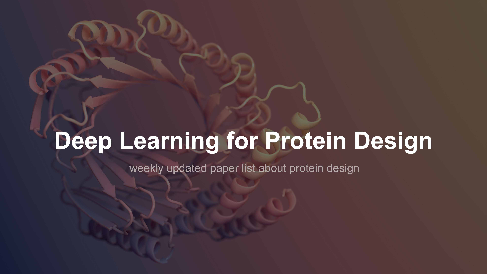

# List of papers about Proteins Design using Deep Learning

> This repository is inspired by the remarkable work of [Kevin Kaichuang Yang](https://github.com/yangkky) and their outstanding project [Machine-learning-for-proteins](https://github.com/yangkky/Machine-learning-for-proteins). We have established this repository to provide a specialized and focused platform for the field of **Deep Learning for Protein Design**, a rapidly advancing domain in computational biology.
> 
> [Contributions](https://github.com/Peldom/papers_for_protein_design_using_DL/blob/main/CONTRIBUTING.md) and [suggestions](https://github.com/Peldom/papers_for_protein_design_using_DL/issues) are warmly welcome!
<!-- >
>1. Mini protein, binders, metalloprotein, antibody, peptide & molecule designs are included.  
>2. More de novo protein design paper list at [Wangchentong](https://github.com/Wangchentong)'s GitHub repo: [paper_for_denovo_protein_design](https://github.com/Wangchentong/paper_for_denovo_protein_design).  
>3. Our notes of these papers are shared in a **[Zhihu Column](https://www.zhihu.com/column/c_1475864742820929537)** (simplified Chinese/English), more suggested notes at [RosettAI](https://www.zhihu.com/column/rosettastudy).   -->

*Papers last week, updated on 2024.01.06:*  
+   Protein sequence design on given backbones with deep learning  
    + [[Protein Engineering, Design and Selection, 2023](https://academic.oup.com/peds/advance-article-abstract/doi/10.1093/protein/gzad024/7503843)]
+   Masked inverse folding with sequence transfer for protein representation learning  
    + [[Protein Engineering, Design and Selection 36 (2023)](https://academic.oup.com/peds/article/doi/10.1093/protein/gzad015/7330543)] • [[code](https://github.com/microsoft/protein-sequence-models)]

------

   
  <!--  -->
  

<!-- ## Menu -->
<!-- > Heading [[2]](#2-model-based-design) follows a **"generator-predictor-optimizer" paradigm**, Heading [[3]](#3-function-to-scaffold), [[4]](#4scaffold-to-sequence)&[[6]](#6-function-to-structure) follow ["Inside-out" paradigm](https://www.nature.com/articles/nature19946)(*function-scaffold-sequence*) from [RosettaCommons](https://www.rosettacommons.org/), Heading [[5]](#5function-to-sequence)&[[7]](#7-other-tasks) follow other ML/DL strategies.   -->

  <strong><a href='#0-benchmarks-and-datasets'>0) Benchmarks and datasets </a></strong>
   
  <a href="#01-sequence-datasets">Sequence datasets</a> •
  <a href="#02-structure-datasets">Structure datasets</a> •
  <a href="#03-databases">Public database</a> •
  <a href="#04-similar-list">Similar list</a>
   
  <strong><a href="#1-reviews">1) Reviews and surveys</a></strong>
   
  <a href="#11-de-novo-protein-design">De novo design</a> •
  <a href="#12-antibody-design">Antibody design</a> •
  <a href="#13-peptide-design">Peptide design</a> •
  <a href="#14-binder-design">Binder design</a> •
  <a href="#15-enzyme-design">Enzyme design</a>
   
  <strong><a href="#2-model-based-design">2) Model-based design</a></strong>
   
  <a href="#21-trrosetta-based">trRosetta-based</a> •
  <a href="#22-alphafold2-based">AlphaFold2-based</a> •
  <a href="#23-dmpfold2-based">DMPfold2-based</a> •
  <a href="#24-cm-align">CM-Align</a> •
  <a href="#25-msa-transformer-based">MSA transformer-based</a> •
  <a href="#26-deepab-based">DeepAb-based</a> •
  <a href="#27-trfold2-based">TRFold2-based</a> •
  <a href="#28-gpt-based">GPT-based</a> •
  <a href="#29-esm-based">ESM-based</a> •
  <a href="#210-sampling-algorithms">Sampling-algorithms</a>
   
  <strong><a href="#3-function-to-scaffold" class="large-link">3) Function to Scaffold</a></strong>
   
  <a href="#31-gan-based">GAN-based</a> •
  <a href="#32-vae-based">VAE-based</a> •
  <a href="#33-dae-based">DAE-based</a> •
  <a href="#34-mlp-based">MLP-based</a> •
  <a href="#35-diffusion-based">Diffusion-based</a> •
  <a href="#36-rl-based">RL-based</a> •
  <a href="#37-flow-based">Flow-based</a>
   
  <strong><a href="#4scaffold-to-sequence">4) Scaffold to Sequence</a></strong>
   
  <a href="#40-review">Review</a> •
  <a href="#41-mlp-based">MLP-based</a> •
  <a href="#42-vae-based">VAE-based</a> •
  <a href="#43-lstm-based">LSTM-based</a> •
  <a href="#44-cnn-based">CNN-based</a> •
  <a href="#45-gnn-based">GNN-based</a> •
  <a href="#46-gan-based">GAN-based</a> •
  <a href="#47-transformer-based">Transformer-based</a> •
  <a href="#48-resnet-based">ResNet-based</a> •
  <a href="#49-diffusion-based">Diffusion-based</a> •
  <a href="#410-bayesian-based">Bayesian method</a> •
  <a href="#411-flow-based">Flow-based</a>
   
  <strong><a href="#5function-to-sequence">5) Function to Sequence</a></strong>
   
  <a href="#51-cnn-based">CNN-based</a> •
  <a href="#52-vae-based">VAE-based</a> •
  <a href="#53-gan-based">GAN-based</a> •
  <a href="#54-transformer-based">Transformer-based</a> •
  <a href="#55-resnet-based">ResNet-based</a> •
  <a href="#56-bayesian-based">Bayesian method</a> •
  <a href="#57-rl-based">Reinforcement Learning</a> •
  <a href="#58-flow-based">Flow-based</a> •
  <a href="#59-rnn-based">RNN-based</a> •
  <a href="#510-lstm-based">LSTM-based</a> •
  <a href="#511-autoregressive-models">Autoregressive</a> •
  <a href="#512-boltzmann-machine-based">Boltzmann machine</a> •
  <a href="#513-diffusion-based">Diffusion-based</a> •
  <a href="#514-gnn-based">GNN-based</a> •
  <a href="#515-score-based">Score-based</a>
   
  <strong><a href="#6-function-to-structure">6) Function to Structure</a></strong>
   
  <a href="#61-lstm-based">LSTM-based</a> •
  <a href="#62-diffusion-based">Diffusion-based</a> •
  <a href="#63-rosettafold-based">RoseTTAFold-based</a> •
  <a href="#64-cnn-based">CNN-based</a> •
  <a href="#65-gnn-based">GNN-based</a> •
  <a href="#66-transformer-based">Transformer-based</a> •
  <a href="#67-mlp-based">MLP-based</a>
   
  <strong><a href="#7-other-tasks">7) Other</a></strong>
   
  <a href="#71-effects-of-mutation--fitness-landscape">Effects of mutations & Fitness Landscape</a>  •
  <a href="#72-protein-language-models-ptm-and-representation-learning">Protein language models and representation learning</a>  •
  <a href="#73-molecular-design-models">Molecular Design Models</a>

------
<!-- - [List of papers about Proteins Design using Deep Learning](#list-of-papers-about-proteins-design-using-deep-learning)
  - [Menu](#menu)
  - [0. Benchmarks and datasets](#0-benchmarks-and-datasets)
    - [0.1 Sequence Datasets](#01-sequence-datasets)
    - [0.2 Structure Datasets](#02-structure-datasets)
    - [0.3 Databases](#03-databases)
      - [0.3.1 Sequence Database](#031-sequence-database)
      - [0.3.2 Structure Database](#032-structure-database)
    - [0.4 Similar List](#04-similar-list)
  - [1. Reviews](#1-reviews)
    - [1.1 De novo protein design](#11-de-novo-protein-design)
    - [1.2 Antibody design](#12-antibody-design)
    - [1.3 Peptide design](#13-peptide-design)
    - [1.4 Binder design](#14-binder-design)
    - [1.5 Enzyme design](#15-enzyme-design)
  - [2. Model-based design](#2-model-based-design)
    - [2.1 trRosetta-based](#21-trrosetta-based)
    - [2.2 AlphaFold2-based](#22-alphafold2-based)
    - [2.3 DMPfold2-based](#23-dmpfold2-based)
    - [2.4 CM-Align](#24-cm-align)
    - [2.5 MSA-transformer-based](#25-msa-transformer-based)
    - [2.6 DeepAb-based](#26-deepab-based)
    - [2.7 TRFold2-based](#27-trfold2-based)
    - [2.8 GPT-based](#28-gpt-based)
    - [2.9 ESM-based](#29-esm-based)
    - [2.10 Sampling-algorithms](#210-sampling-algorithms)
  - [3. Function to Scaffold](#3-function-to-scaffold)
    - [3.1 GAN-based](#31-gan-based)
    - [3.2 VAE-based](#32-vae-based)
    - [3.3 DAE-based](#33-dae-based)
    - [3.4 MLP-based](#34-mlp-based)
    - [3.5 Diffusion-based](#35-diffusion-based)
    - [3.6 RL-based](#36-rl-based)
  - [4.Scaffold to Sequence](#4scaffold-to-sequence)
    - [4.1 MLP-based](#41-mlp-based)
    - [4.2 VAE-based](#42-vae-based)
    - [4.3 LSTM-based](#43-lstm-based)
    - [4.4 CNN-based](#44-cnn-based)
    - [4.5 GNN-based](#45-gnn-based)
    - [4.6 GAN-based](#46-gan-based)
    - [4.7 Transformer-based](#47-transformer-based)
    - [4.8 ResNet-based](#48-resnet-based)
    - [4.9 Diffusion-based](#49-diffusion-based)
  - [5.Function to Sequence](#5function-to-sequence)
    - [5.1 CNN-based](#51-cnn-based)
    - [5.2 VAE-based](#52-vae-based)
    - [5.3 GAN-based](#53-gan-based)
    - [5.4 Transformer-based](#54-transformer-based)
    - [5.5 ResNet-based](#55-resnet-based)
    - [5.6 Bayesian-based](#56-bayesian-based)
    - [5.7 RL-based](#57-rl-based)
    - [5.8 Flow-based](#58-flow-based)
    - [5.9 RNN-based](#59-rnn-based)
    - [5.10 LSTM-based](#510-lstm-based)
    - [5.11 Autoregressive-models](#511-autoregressive-models)
    - [5.12 Boltzmann-machine-based](#512-boltzmann-machine-based)
    - [5.13 Diffusion-based](#513-diffusion-based)
  - [6. Function to Structure](#6-function-to-structure)
    - [6.1 LSTM-based](#61-lstm-based)
    - [6.2 Diffusion-based](#62-diffusion-based)
    - [6.3 RoseTTAFold-based](#63-rosettafold-based)
    - [6.4 CNN-based](#64-cnn-based)
    - [6.5 GNN-based](#65-gnn-based)
    - [6.6 Transformer-based](#66-transformer-based)
  - [7. Other tasks](#7-other-tasks)
    - [7.1 Effects of mutation \& Fitness Landscape](#71-effects-of-mutation--fitness-landscape)
    - [7.2 Protein Language Models (PTM) and representation learning](#72-protein-language-models-ptm-and-representation-learning)
    - [7.3 Molecular Design Models](#73-molecular-design-models)
      - [7.3.1 Gradient optimization](#731-gradient-optimization)
      - [7.3.2 Optimized sampling](#732-optimized-sampling) -->

## 0. Benchmarks and datasets

### 0.1 Sequence Datasets

**FLIP: Benchmark tasks in fitness landscape inference for proteins**  
Christian Dallago, Jody Mou, Kadina E Johnston, Bruce Wittmann, Nick Bhattacharya, Samuel Goldman, Ali Madani, Kevin K Yang  
[NeurIPS 2021 Datasets and Benchmarks Track](https://openreview.net/forum?id=p2dMLEwL8tF)/[bioRxiv 2021](https://www.biorxiv.org/content/10.1101/2021.11.09.467890v2) • [website](https://benchmark.protein.properties/) • [code](https://github.com/J-SNACKKB/FLIP) • [supplementary](https://www.biorxiv.org/content/biorxiv/early/2022/01/19/2021.11.09.467890/DC1/embed/media-1.pdf)

**A Benchmark Framework for Evaluating Structure-to-Sequence Models for Protein Design**  
Jeffrey Chan, Seyone Chithrananda, David Brookes, Sam Sinai  
Paper unavailable at [Machine Learning in Structural Biology Workshop 2022](https://nips.cc/Conferences/2022/ScheduleMultitrack?event=50005)

**PDBench: Evaluating Computational Methods for Protein-Sequence Design**  
Leonardo V Castorina, Rokas Petrenas, Kartic Subr, Christopher W Wood  
[Bioinformatics, 2023;, btad027](https://academic.oup.com/bioinformatics/advance-article/doi/10.1093/bioinformatics/btad027/6986968) • [code](https://github.com/wells-wood-research/PDBench)

**Benchmarking deep generative models for diverse antibody sequence design**  
Igor Melnyk, Payel Das, Vijil Chenthamarakshan, Aurelie Lozano  
[arXiv:2111.06801](https://arxiv.org/abs/2111.06801)

**The Protein Engineering Tournament: An Open Science Benchmark for Protein Modeling and Design**  
Chase Armer, Hassan Kane, Dana Cortade, Dave Estell, Adil Yusuf, Radhakrishna Sanka, Henning Redestig, TJ Brunette, Pete Kelly, Erika DeBenedictis  
[arXiv:2309.09955](https://arxiv.org/abs/2309.09955v2)  

**Computational Scoring and Experimental Evaluation of Enzymes Generated by Neural Networks**  
Sean R.Johnson, Xiaozhi Fu, Sandra Viknander, Clara Goldin, Sarah Monaco, Aleksej Zelezniak, Kevin K. Yang  
[bioRxiv (2023)](https://www.biorxiv.org/content/10.1101/2023.03.04.531015v2) • [code](https://github.com/seanrjohnson/protein_scoring)  

**ProteinGym: Large-Scale Benchmarks for Protein Design and Fitness Prediction**  
Pascal Notin, Aaron W Kollasch, Daniel Ritter, Lood van Niekerk, Steffanie Paul, Hansen Spinner, Nathan Rollins, Ada Shaw, Ruben Weitzman, Jonathan Frazer, Mafalda Dias, Dinko Franceschi, Rose Orenbuch, Yarin Gal, Debora S Marks  
[bioRxiv 2023.12.07.570727](https://biorxiv.org/content/10.1101/2023.12.07.570727v1) • [code](https://github.com/OATML-Markslab/ProteinGym)

### 0.2 Structure Datasets

**AlphaDesign: A graph protein design method and benchmark on AlphaFoldDB**  
Zhangyang Gao, Cheng Tan, Stan Z. Li  
[arxiv (2022)](https://arxiv.org/abs/2202.01079)

**SidechainNet: An All-Atom Protein Structure Dataset for Machine Learning**
Jonathan E. King, David Ryan Koes  
[arxiv](https://arxiv.org/abs/2010.08162) • [github::sidechainnet](https://github.com/jonathanking/sidechainnet)  

[TDC](https://tdcommons.ai/overview/) maintains a resource list that currently contains 22 tasks (and its datasets) related to small molecules and macromolecules, including PPI, DDI and so on. [MoleculeNet](https://github.com/GLambard/Molecules_Dataset_Collection) published a small molecule related benchmark four years ago.

> In terms of datasets and benchmarks, protein design is far less mature than drug discovery ([paperwithcode drug discovery benchmarks](https://paperswithcode.com/task/drug-discovery)). (Maybe should add the evaluation of protein design for deep learning method (especially deep generative model))  
> Difficulties and opportunities always coexist. Happy to see the work of [Christian Dallago, Jody Mou, Kadina E. Johnston, Bruce J. Wittmann, Nicholas Bhattacharya, Samuel Goldman, Ali Madani, Kevin K. Yang](https://www.biorxiv.org/content/10.1101/2021.11.09.467890v1) and [Zhangyang Gao, Cheng Tan, Stan Z. Li](https://arxiv.org/abs/2202.01079).

**Sampling of structure and sequence space of small protein folds**  
Linsky, T.W., Noble, K., Tobin, A.R. et al.  
[Nat Commun 13, 7151 (2022)](https://www.nature.com/articles/s41467-022-34937-8) • [code](https://github.com/strauchlab/scaffold_design) • [Supplementary](https://static-content.springer.com/esm/art%3A10.1038%2Fs41467-022-34937-8/MediaObjects/41467_2022_34937_MOESM1_ESM.pdf)

**OpenProteinSet: Training data for structural biology at scale**  
Gustaf Ahdritz, Nazim Bouatta, Sachin Kadyan, Lukas Jarosch, Daniel Berenberg, Ian Fisk, Andrew M. Watkins, Stephen Ra, Richard Bonneau, Mohammed AlQuraishi
[arXiv:2308.05326](https://arxiv.org/abs/2308.05326) • [OpenFold](https://github.com/aqlaboratory/openfold)

**ProteinInvBench: Benchmarking Protein Design on Diverse Tasks, Models, and Metrics**  
Zhangyang Gao, Cheng Tan, Yijie Zhang, Xingran Chen, Stan Z. Li  
[GitHub](https://github.com/A4Bio/ProteinInvBench)

**PDB-Struct: A Comprehensive Benchmark for Structure-based Protein Design**  
Wang, Chuanrui, et al.  
[arXiv preprint arXiv:2312.00080 (2023)](https://arxiv.org/abs/2312.00080) • [code](https://github.com/WANG-CR/PDB-Struct)

### 0.3 Databases

> A list of suggested protein databases, more lists at [CNCB](https://ngdc.cncb.ac.cn/databasecommons/).
>
#### 0.3.1 Sequence Database

1. [UniProt](https://www.uniprot.org/downloads)
2. [DisProt](https://disprot.org)
3. [MobiDB](https://mobidb.bio.unipd.it/)

#### 0.3.2 Structure Database

Database | Description
---------|----------
[PDB](https://www.rcsb.org/) | The Protein Data Bank (PDB) is a database of 3D structural data of large biological molecules, such as proteins and nucleic acids. These data are gathered using experimental methods such as X-ray crystallography, NMR spectroscopy, or cryo-electron microscopy.
[AlphaFoldDB](https://alphafold.ebi.ac.uk/) | AlphaFoldDB is a database of protein structure predictions produced by DeepMind's AlphaFold system. It provides highly accurate predictions of protein 3D structures.
[PDBbind](http://www.pdbbind.org.cn/download.php) | PDBbind is a comprehensive collection of the binding data of all types of biomolecular complexes in the PDB database. It is primarily used for the development and validation of computational methods for predicting molecular interactions.
[AB-Bind](https://github.com/sarahsirin/AB-Bind-Database) | AB-Bind is a database for antibody binding affinity data. It offers a curated set of experimental binding data and corresponding antibody-protein complex structures.
[AntigenDB](http://crdd.osdd.net/raghava/antigendb/) | AntigenDB is a manually curated database of experimentally verified antigens that includes detailed information about the antigen, the source organism, and the associated antibodies.
[CAMEO](https://www.cameo3d.org/) | CAMEO (Continuous Automated Model EvaluatiOn) is a project for the automated evaluation of methods predicting macromolecular structure. It continuously assesses the performance of automated protein structure prediction servers.
[CAPRI](https://www.ebi.ac.uk/msd-srv/capri/) | The Critical Assessment of PRediction of Interactions (CAPRI) is a community-wide experiment to evaluate protein-protein interaction prediction methods.
[PIFACE](http://prism.ccbb.ku.edu.tr/piface) | PIFACE is a web server for the prediction of protein-protein interactions. It identifies potential interaction interfaces on protein surfaces.
[SAbDab](http://opig.stats.ox.ac.uk/webapps/newsabdab/sabdab/) | The Structural Antibody Database (SAbDab) is an automatically updated resource for the structural information of antibodies from the PDB. It allows for easy access to curated, annotated, and classified antibody structures.
[SKEMPI v2.0](https://life.bsc.es/pid/skempi2) | SKEMPI 2.0 is a database of experimental measurements of the change in binding free energy caused by mutations in protein-protein complexes.
[ProtCAD](http://dunbrack2.fccc.edu/protcad/) | ProtCAD is a suite of tools for the design and engineering of novel protein structures, sequences, and functions. It allows users to build and manipulate complex protein structures, generate and evaluate sequence libraries, and simulate mutational effects. ProtCAD is a suite of tools for the design and engineering of novel protein structures, sequences, and functions. It allows users to build and manipulate complex protein structures, generate and evaluate sequence libraries, and simulate mutational effects.

### 0.4 Similar List

> Some similar GitHub lists that include papers about protein design using deep learning:

1. [design_tools](https://github.com/hefeda/design_tools/blob/main/README.md)
2. [awesome-AI-based-protein-design](https://github.com/opendilab/awesome-AI-based-protein-design)
3. [ProteinStructureWithDL](https://github.com/Yang-J-LIN/ProteinStructureWithDL)
4. [List of available bioinformatic tools and services](https://neurosnap.ai/services)

## 1. Reviews

### 1.1 De novo protein design

**Protein design: from computer models to artificial intelligence**  
Paladino, Antonella, et al.  
[Wiley Interdisciplinary Reviews: Computational Molecular Science 7.5 (2017): e1318](https://wires.onlinelibrary.wiley.com/doi/10.1002/wcms.1318)

**Advances in protein structure prediction and design**  
Kuhlman, B., Bradley, P.  
[Nat Rev Mol Cell Biol 20, 681-697 (2019)](https://www.nature.com/articles/s41580-019-0163-x)

**Deep learning in protein structural modeling and design**  
Wenhao Gao, Sai Pooja Mahajan, Jeremias Sulam, and Jeffrey J. Gray  
[Patterns 1.9](https://www.sciencedirect.com/science/article/pii/S2666389920301902) • 2020  

**100th anniversary of macromolecular science viewpoint: Data-driven protein design**  
Ferguson, Andrew L., and Rama Ranganathan.  
[ACS Macro Letters 10.3 (2021)](https://pubs.acs.org/doi/abs/10.1021/acsmacrolett.0c00885)

**Artificial intelligence in early drug discovery enabling precision medicine**  
Boniolo, Fabio, et al.  
[Expert Opinion on Drug Discovery 16.9 (2021)](https://www.tandfonline.com/doi/full/10.1080/17460441.2021.1918096)

**Protein design with deep learning**  
Defresne, Marianne, Sophie Barbe, and Thomas Schiex.  
[International Journal of Molecular Sciences 22.21 (2021)](https://www.mdpi.com/1422-0067/22/21/11741)

**Protein sequence design with deep generative models**  
Zachary Wu, Kadina E. Johnston, Frances H. Arnold, Kevin K. Yang  
[Current Opinion in Chemical Biology 65](https://www.sciencedirect.com/science/article/pii/S136759312100051X) • [note](https://zhuanlan.zhihu.com/p/466616309) • 2021  

**Structure-based protein design with deep learning**  
Ovchinnikov, Sergey, and Po-Ssu Huang.  
[Current opinion in chemical biology 65](https://www.sciencedirect.com/science/article/pii/S1367593121001125) • [note](https://zhuanlan.zhihu.com/p/467001175) • 2021  

**Deep learning techniques have significantly impacted protein structure prediction and protein design**  
Pearce, Robin, and Yang Zhang.  
[Current opinion in structural biology 68 (2021)](https://www.sciencedirect.com/science/article/pii/S0959440X21000142)

**Recent advances in de novo protein design: Principles, methods, and applications**  
Pan, Xingjie, and Tanja Kortemme.  
[Journal of Biological Chemistry 296 (2021)](https://www.sciencedirect.com/science/article/pii/S0021925821003367)

**Protein design via deep learning**  
Wenze Ding, Kenta Nakai, Haipeng Gong  
[Briefings in Bioinformatics](https://academic.oup.com/bib/advance-article/doi/10.1093/bib/bbac102/6554124) • 25 March 2022

**Deep generative modeling for protein design**  
Strokach, Alexey, and Philip M. Kim.  
[Current Opinion in Structural Biology](https://www.sciencedirect.com/science/article/pii/S0959440X21001573) • 2022  

**Deep learning approaches for conformational flexibility and switching properties in protein design**  
Rudden, Lucas SP, Mahdi Hijazi, and Patrick Barth  
[Frontiers in Molecular Biosciences](https://www.frontiersin.org/articles/10.3389/fmolb.2022.928534/full)

**Computational protein design with evolutionary-based and physics-inspired modeling: current and future synergies**  
Cyril Malbranke, David Bikard, Simona Cocco, Rémi Monasson, Jérôme Tubiana  
[arXiv:2208.13616v2](https://arxiv.org/abs/2208.13616v2)

**From sequence to function through structure: deep learning for protein design**  
Noelia Ferruz, Michael Heinzinger, Mehmet Akdel, Alexander Goncearenco, Luca Naef, Christian Dallago  
[bioRxiv 2022.08.31.505981](https://www.biorxiv.org/content/10.1101/2022.08.31.505981v1)/[Computational and Structural Biotechnology Journal
Volume 21, 2023](https://www.sciencedirect.com/science/article/pii/S2001037022005086) • [Supplementary](https://www.biorxiv.org/content/biorxiv/early/2022/09/03/2022.08.31.505981/DC1/embed/media-1.pdf) • [accompanying list](https://github.com/hefeda/design_tools/blob/main/README.md)

**Computational protein design with data-driven approaches: Recent developments and perspectives**  
Liu, H, Chen, Q.  
[WIREs Comput Mol Sci. 2022. e1646](https://wires.onlinelibrary.wiley.com/doi/10.1002/wcms.1646)

**Understanding by design: Implementing deep learning from protein structure prediction to protein design**  
Gao, Yuanxu, Jiangshan Zhan, and Albert CH Yu.  
[MedComm-Future Medicine 1.2 (2022): e22](https://onlinelibrary.wiley.com/doi/full/10.1002/mef2.22)

**Diffusion Models in Bioinformatics: A New Wave of Deep Learning Revolution in Action**  
Zhiye Guo, Jian Liu, Yanli Wang, Mengrui Chen, Duolin Wang, Dong Xu, Jianlin Cheng  
[arXiv:2302.10907](https://arxiv.org/abs/2302.10907)

**Machine learning for evolutionary-based and physicsinspired protein design: Current and future synergies**  
Cyril Malbranke, David Bikard, Simona Cocco, Rémi Monasson, Jérôme Tubiana  
[Current Opinion in Structural Biology](https://www.sciencedirect.com/science/article/pii/S0959440X23000453)

**De novo design of polyhedral protein assemblies: before and after the AI revolution**  
Bhoomika Basu Mallik, Jenna Stanislaw, Tharindu Madhusankha Alawathurage, and Alena Khmelinskaia  
[ChemBioChem 2023, e202300117](http://dx.doi.org/10.1002/cbic.202300117)

**Research progress of artificial intelligence in protein design**  
CHEN Zhihang, JI Menglin, QI Yifei  
[Synthetic Biology Journal (2023)](https://synbioj.cip.com.cn/article/2023/2096-8280/2023-008.shtml)

**A Survey on Graph Diffusion Models: Generative AI in Science for Molecule, Protein and Material**  
Mengchun Zhang, Maryam Qamar, Taegoo Kang, Yuna Jung, Chenshuang Zhang, Sung-Ho Bae, Chaoning Zhang  
[https://arxiv.org/abs/2304.01565](https://arxiv.org/pdf/2304.01565.pdf)

**Exploring the Protein Sequence Space with Global Generative Models**  
Sergio Romero-Romero, Sebastian Lindner, Noelia Ferruz  
[arXiv:2305.01941](https://arxiv.org/abs/2305.01941)

**The Era of Machine Learning for Protein Design, Summarized in Four Key Methods**  
LucianoSphere  
[Towards Data Science](https://towardsdatascience.com/the-era-of-machine-learning-for-protein-design-summarized-in-four-key-methods-d6f1dac5de96)

**Is novelty predictable?**  
Clara Fannjiang, Jennifer Listgarten  
[arXiv:2306.00872](https://arxiv.org/abs/2306.00872)

**Computational protein design - where it goes?**  
Xu Binbin, Chen Yingjun and Xue Weiwei  
[Current Medicinal Chemistry 2023](https://www.eurekaselect.com/article/132267)

**How can the protein design community best support biologists who want to harness AI tools for protein structure prediction and design?**  
Höcker, Birte, et al.  
[Cell Systems 14.8 (2023)](https://www.cell.com/cell-systems/fulltext/S2405-4712(23)00212-0)

**De novo 設計ナノポアの創製**  
新津藍  
[生物工学会誌 101.8 (2023)](https://www.jstage.jst.go.jp/article/seibutsukogaku/101/8/101_101.8_431/_article/-char/ja/)

**Generative artificial intelligence for de novo protein design**  
Adam Winnifrith, Carlos Outeiral, Brian Hie  
[arXiv:2310.09685](https://arxiv.org/abs/2310.09685)

**Generative models for protein sequence modeling: recent advances and future directions**  
Mehrsa Mardikoraem, Zirui Wang, Nathaniel Pascual, Daniel Woldring  
[Briefings in Bioinformatics](https://academic.oup.com/bib/article/24/6/bbad358/7325909)

**A new age in protein design empowered by deep learning**  
Khakzad, Hamed et al  
[Cell Systems, Volume 14, Issue 11](https://www.cell.com/cell-systems/fulltext/S2405-4712(23)00298-3)

### 1.2 Antibody design

**A review of deep learning methods for antibodies**  
Graves, Jordan, et al.  
[Antibodies 9.2 (2020)](https://www.ncbi.nlm.nih.gov/pmc/articles/PMC7344881/pdf/antibodies-09-00012.pdf)

**Progress and challenges for the machine learning-based design of fit-for-purpose monoclonal antibodies**  
Akbar, Rahmad, et al.  
[Mabs. Vol. 14. No. 1. Taylor & Francis, 2022](https://www.ncbi.nlm.nih.gov/pmc/articles/PMC8928824/)

**Advances in computational structure-based antibody design**  
Hummer, Alissa M., Brennan Abanades, and Charlotte M. Deane.  
[Current Opinion in Structural Biology 74 (2022)](https://www.sciencedirect.com/science/article/pii/S0959440X22000586)

**Computational and artificial intelligence-based methods for antibody development**  
Kim, Jisun, et al.  
[Trends in Pharmacological Sciences (2023)](https://www.sciencedirect.com/science/article/pii/S0165614722002796)

**Leveraging deep learning to improve vaccine design**  
Hederman AP, Ackerman ME  
[Trends in immunology (2023)](https://www.cell.com/trends/immunology/fulltext/S1471-4906(23)00046-7)

**In Silico Approaches to Deliver Better Antibodies by Design: The Past, the Present and the Future**  
Andreas Evers, Shipra Malhotra, Vanita D. Sood  
[arXiv:2305.07488](https://arxiv.org/abs/2305.07488)

**AI Models for Protein Design are Driving Antibody Engineering**  
Michael Chungyoun, Jeffrey J. Gray  
[Current Opinion in Biomedical Engineering (2023): 100473](https://www.sciencedirect.com/science/article/abs/pii/S2468451123000296)

**Computational Methods in Immunology and Vaccinology: Design and Development of Antibodies and Immunogens**  
Federica Guarra and Giorgio Colombo  
[Journal of Chemical Theory and Computation (2023)](https://pubs.acs.org/doi/10.1021/acs.jctc.3c00513)

**Simplifying complex antibody engineering using machine learning**  
Makowski, Emily K., Hsin-Ting Chen, and Peter M. Tessier.  
[Cell Systems 14.8 (2023)](https://www.cell.com/cell-systems/fulltext/S2405-4712(23)00118-7)/[2022 AIChE Annual Meeting. AIChE, 2022.](https://aiche.confex.com/aiche/2022/meetingapp.cgi/Paper/650993)

**AI driven B-cell Immunotherapy Design**  
Bruna Moreira da Silva, David B. Ascher, Nicholas Geard, Douglas E. V. Pires  
[arXiv:2309.01122](https://arxiv.org/abs/2309.01122)

**Best practices for machine learning in antibody discovery and development**  
Leonard Wossnig, Norbert Furtmann, Andrew Buchanan, Sandeep Kumar, Victor Greiff  
[arXiv:2312.08470](https://arxiv.org/abs/2312.08470)

### 1.3 Peptide design

**Deep generative models for peptide design**  
Wan, Fangping, Daphne Kontogiorgos-Heintz, and Cesar de la Fuente-Nunez  
[Digital Discovery (2022)](https://pubs.rsc.org/en/content/articlehtml/2022/dd/d1dd00024a)

**Design of protein segments and peptides for binding to protein targets**  
Gupta, Suchetana, Noora Azadvari, and Parisa Hosseinzadeh.  
[BioDesign Research 2022 (2022)](https://spj.science.org/doi/10.34133/2022/9783197)

**Revolutionizing peptide-based drug discovery: Advances in the post-AlphaFold era**  
Chang, Liwei, et al.  
[Wiley Interdisciplinary Reviews: Computational Molecular Science](https://wires.onlinelibrary.wiley.com/doi/epdf/10.1002/wcms.1693)

### 1.4 Binder design

**Improving de novo Protein Binder Design with Deep Learning**  
Nathaniel Bennett, Brian Coventry, Inna Goreshnik, Buwei Huang, Aza Allen, Dionne Vafeados, Ying Po Peng, Justas Dauparas, Minkyung Baek, Lance Stewart, Frank DiMaio, Steven De Munck, Savvas Savvides, David Baker  
[bioRxiv 2022.06.15.495993](https://www.biorxiv.org/content/10.1101/2022.06.15.495993v1)/[Nat Commun 14, 2625 (2023)](https://www.nature.com/articles/s41467-023-38328-5) • [code](https://github.com/nrbennet/dl_binder_design) • [news](https://phys.org/news/2023-08-deep-protein.html)

### 1.5 Enzyme design

**A review of enzyme design in catalytic stability by artificial intelligence**  
Yongfan Ming, Wenkang Wang, Rui Yin, Min Zeng, Li Tang, Shizhe Tang, Min Li  
[Briefings in Bioinformatics, 2023](https://academic.oup.com/bib/advance-article-abstract/doi/10.1093/bib/bbad065/7086816)

**Application of "foldability" in the intelligent of enzymes engineering and design: take AlphaFold2 for example**  
MENG Qiaozhen, GUO Fei  
[Synthetic Biology Journal (2023)](https://synbioj.cip.com.cn/article/2023/2096-8280/2023-011.shtml)

**AlphaFold2 and Deep Learning for Elucidating Enzyme Conformational Flexibility and Its Application for Design**  
Casadevall, Guillem, Cristina Duran, and Sí­lvia Osuna.  
[JACS Au (2023)](https://pubs.acs.org/doi/10.1021/jacsau.3c00188)

**Accelerating Biocatalysis Discovery with Machine Learning: A Paradigm Shift in Enzyme Engineering, Discovery, and Design**  
Braun Markus, Gruber Christian C, Krassnigg Andreas, Kummer Arkadij, Lutz Stefan, Oberdorfer Gustav, Siirola Elina, and Snajdrova Radka  
[ACS Catal. 2023](https://pubs.acs.org/doi/10.1021/acscatal.3c03417)

**Building Enzymes through Design and Evolution**  
Hossack, Euan J., Florence J. Hardy, and Anthony P. Green.  
[ACS Catalysis 13.19 (2023)](https://pubs.acs.org/doi/10.1021/acscatal.3c02746)

**Advances in generative modeling methods and datasets to design novel enzymes for renewable chemicals and fuels**  
Rana A Barghout, Zhiqing Xu, Siddharth Betala, Radhakrishnan Mahadevan  
[Current Opinion in Biotechnology, Volume 84, 2023](https://www.sciencedirect.com/science/article/abs/pii/S0958166923001179)

## 2. Model-based design

> Invert trained models with optimize algorithms through iterations for sequence design. Inverted structure prediction models are known as **Hallucination**.

### 2.1 trRosetta-based

**Design of proteins presenting discontinuous functional sites using deep learning**  
Doug Tischer, Sidney Lisanza, Jue Wang, Runze Dong,  View ORCID ProfileIvan Anishchenko, Lukas F. Milles, Sergey Ovchinnikov, David Baker  
[bioRxiv (2020)](https://www.biorxiv.org/content/10.1101/2020.11.29.402743v1)  

**Fast differentiable DNA and protein sequence optimization for molecular design**  
Linder, Johannes, and Georg Seelig.  
[arXiv preprint arXiv:2005.11275 (2020)](https://arxiv.org/abs/2005.11275)

**De novo protein design by deep network hallucination**  
Ivan Anishchenko, Samuel J. Pellock, Tamuka M. Chidyausiku, Theresa A. Ramelot, Sergey Ovchinnikov, Jingzhou Hao, Khushboo Bafna, Christoffer Norn, Alex Kang, Asim K. Bera, Frank DiMaio, Lauren Carter, Cameron M. Chow, Gaetano T. Montelione & David Baker  
[Nature (2021)](https://doi.org/10.1038/s41586-021-04184-w)  • [code](https://github.com/gjoni/trDesign) • [trRosetta](https://yanglab.nankai.edu.cn/trRosetta/download/)

**Protein sequence design by conformational landscape optimization**  
Norn, Christoffer, et al.  
[Proceedings of the National Academy of Sciences 118.11 (2021)](https://www.pnas.org/content/118/11/e2017228118) • [code](https://github.com/gjoni/trDesign)

**De novo design of small beta barrel proteins**  
David E. Kim  and Davin R. Jensen  and David Feldman  and Doug Tischer  and Ayesha Saleem  and Cameron M. Chow  and Xinting Li  and Lauren Carter  and Lukas Milles  and Hannah Nguyen  and Alex Kang  and Asim K. Bera  and Francis C. Peterson  and Brian F. Volkman  and Sergey Ovchinnikov  and David Baker  
[PNAS(2023),e2207974120](https://www.pnas.org/doi/10.1073/pnas.2207974120) • [code](https://github.com/sokrypton/TrDesign_partialhal)

**Exploring "dark matter" protein folds using deep learning**  
Zander Harteveld, Alexandra Van Hall-Beauvais, Irina Morozova, Joshua Southern, Casper Alexander Goverde, Sandrine Georgeon, Stephane Rosset, Andreas Loukas, Pierre Vandergheynst, Michael Bronstein, Bruno Correia  
[bioRxiv 2023.08.30.555621](https://www.biorxiv.org/content/10.1101/2023.08.30.555621v1) • [Suppplymentary](https://www.biorxiv.org/content/biorxiv/early/2023/09/01/2023.08.30.555621/DC1/embed/media-1.pdf) • [code](https://github.com/zanderharteveld/genesis)

### 2.2 AlphaFold2-based

**Solubility-aware protein binding peptide design using AlphaFold**  
Takatsugu Kosugi, Masahito Ohue  
[bioRxiv 2022.05.14.491955](https://doi.org/10.1101/2022.05.14.491955) • [Supplemental Materials](https://www.biorxiv.org/content/biorxiv/early/2022/05/15/2022.05.14.491955/DC1/embed/media-1.pdf)

**End-to-end learning of multiple sequence alignments with differentiable Smith-Waterman**  
Petti, Samantha, Bhattacharya, Nicholas, Rao, Roshan, Dauparas, Justas, Thomas, Neil, Zhou, Juannan, Rush, Alexander M, Koo, Peter K, Ovchinnikov, Sergey  
[bioRxiv (2021)](http://repository.cshl.edu/id/eprint/40409/)/[Bioinformatics, 2022;, btac724](https://academic.oup.com/bioinformatics/advance-article/doi/10.1093/bioinformatics/btac724/6820925) • [ColabDesign](https://github.com/sokrypton/ColabDesign), [SMURF](https://github.com/spetti/SMURF), [AF2 back propagation](https://github.com/sokrypton/af_backprop) • [our notes1](https://zhuanlan.zhihu.com/p/468219547), [notes2](https://zhuanlan.zhihu.com/p/472037977) • [lecture1](https://www.youtube.com/watch?v=2HmXwlKWMVs), [lecture2](https://www.youtube.com/watch?v=BJdRvODiDnk) • [Discord](https://discord.com/invite/FpYPneYB)

**AlphaDesign: A de novo protein design framework based on AlphaFold**  
Jendrusch, Michael, Jan O. Korbel, and S. Kashif Sadiq.  
[bioRxiv (2021)](https://www.biorxiv.org/content/10.1101/2021.10.11.463937v1)  

**Using AlphaFold for Rapid and Accurate Fixed Backbone Protein Design**  
Moffat, Lewis, Joe G. Greener, and David T. Jones.  
[bioRxiv (2021)](https://www.biorxiv.org/content/10.1101/2021.08.24.457549v1)  

**State-of-the-art estimation of protein model accuracy using AlphaFold**  
James P. Roney, Sergey Ovchinnikov  
[bioRxiv 2022.03.11.484043](https://www.biorxiv.org/content/10.1101/2022.03.11.484043v3)/[Physical Review Letters 129.23 (2022)](https://journals.aps.org/prl/abstract/10.1103/PhysRevLett.129.238101) • [code](https://github.com/jproney/AF2Rank)

**Hallucinating protein assemblies**  
Basile I M Wicky, Lukas F Milles, Alexis Courbet, Robert J Ragotte, Justas Dauparas, Elias Kinfu, Sam Tipps, Ryan D Kibler, Minkyung Baek, Frank DiMaio, Xinting Li, Lauren Carter, Alex Kang, Hannah Nguyen, Asim K Bera, David Baker  
[bioRxiv 2022.06.09.493773](https://www.biorxiv.org/content/10.1101/2022.06.09.493773v1)/[Science (2022)](https://www.science.org/doi/10.1126/science.add1964) • [related slides](https://docs.google.com/presentation/d/1_tvzLKks83sYOKemfFeImCPnWtCQ-CHqmKK_3IQI1so/) • [our notes](https://zhuanlan.zhihu.com/p/527152827) • [news](https://www.nature.com/articles/d41586-022-02947-7)

**EvoBind: in silico directed evolution of peptide binders with AlphaFold**  
Patrick Bryant, Arne Elofsson  
[bioRxiv 2022.07.23.501214](https://www.biorxiv.org/content/10.1101/2022.07.23.501214v1) • [code](https://github.com/patrickbryant1/EvoBind)

**Hallucination of closed repeat proteins containing central pockets**  
Linna An, Derrick R Hicks, Dmitri Zorine, Justas Dauparas, Basile I. M. Wicky, Lukas F Milles, Alexis Courbet, Asim K. Bera, Hannah Nguyen, Alex Kang, Lauren Carter, David Baker  
[bioRxiv 2022.09.01.506251](https://www.biorxiv.org/content/10.1101/2022.09.01.506251v1)/[Nat Struct Mol Biol 30, 1755-1760 (2023)](https://www.nature.com/articles/s41594-023-01112-6) • [Supplementary data](https://static-content.springer.com/esm/art%3A10.1038%2Fs41594-023-01112-6/MediaObjects/41594_2023_1112_MOESM1_ESM.pdf)

**Predicting the structure of large protein complexes using AlphaFold and Monte Carlo tree search**  
Bryant, Patrick, et al.  
[Nature communications 13.1 (2022)](https://www.nature.com/articles/s41467-022-33729-4) • [gitlba](https://gitlab.com/patrickbryant1/molpc), [github](https://github.com/patrickbryant1/MoLPC) • [Supplementary data1](https://doi.org/10.5281/zenodo.6367019), [Supplementary data2](https://doi.org/10.17044/scilifelab.19375172)

**De novo protein design by inversion of the AlphaFold structure prediction network**  
Casper Goverde, Benedict Wolf, Hamed Khakzad, Stephane Rosset, Bruno E Correia  
[bioRxiv 2022.12.13.520346](https://www.biorxiv.org/content/10.1101/2022.12.13.520346v1) • [code](https://github.com/bene837/af_gradmcmc) • [lecture1](https://www.youtube.com/watch?v=aUMGuogMZCA) • [lecture2](https://www.youtube.com/watch?v=4S4J7gbhAa0)

**Code of OpenComplex**  
Jingcheng, Yu and Zhaoming, Chen and Zhaoqun, Li and Mingliang, Zeng and Wenjun, Lin and He, Huang and Qiwei, Ye  
[code](https://github.com/baaihealth/OpenComplex)

**Efficient and scalable de novo protein design using a relaxed sequence space**  
Christopher Josef Frank, Ali Khoshouei, Yosta de Stigter, Dominik Schiewitz, Shihao Feng, Sergey Ovchinnikov, Hendrik Dietz  
[bioRxiv 2023.02.24.529906](https://www.biorxiv.org/content/10.1101/2023.02.24.529906v1) • [code](https://github.com/sokrypton/ColabDesign/blob/main/af/examples/af_relax_design.ipynb)

**Cyclic peptide structure prediction and design using AlphaFold**  
Stephen A. Rettie, Katelyn V. Campbell, Asim K. Bera, Alex Kang, Simon Kozlov, Joshmyn De La Cruz, Victor Adebomi, Guangfeng Zhou, Frank DiMaio, Sergey Ovchinnikov, Gaurav Bhardwaj  
[bioRxiv](https://www.biorxiv.org/content/10.1101/2023.02.25.529956v1.full.pdf) • [Code](https://github.com/sokrypton/ColabDesign/blob/main/af/examples/af_cyc_design.ipynb) • [Supplementary](https://www.biorxiv.org/content/biorxiv/early/2023/02/26/2023.02.25.529956/DC1/embed/media-1.xlsx)

**De novo design of luciferases using deep learning**  
Andy Hsien-Wei Yeh, Christoffer Norn, Yakov Kipnis, Doug Tischer, Samuel J. Pellock, Declan Evans, Pengchen Ma, Gyu Rie Lee, Jason Z. Zhang, Ivan Anishchenko, Brian Coventry, Longxing Cao, Justas Dauparas, Samer Halabiya, Michelle DeWitt, Lauren Carter, K. N. Houk & David Baker  
[Nature](https://www.nature.com/articles/s41586-023-05696-3) • [Code](https://files.ipd.uw.edu/pub/luxSit/scaffold_generation.tar.gz) • [Supplementary Materials](https://static-content.springer.com/esm/art%3A10.1038%2Fs41586-023-05696-3/MediaObjects/41586_2023_5696_MOESM1_ESM.pdf)

**In silico evolution of protein binders with deep learning models for structure prediction and sequence design**  
Odessa J Goudy, Amrita Nallathambi, Tomoaki Kinjo, Nicholas Randolph, Brian Kuhlman  
[bioRxiv 2023.05.03.539278](https://www.biorxiv.org/content/10.1101/2023.05.03.539278v1) • [Supplementary](https://www.biorxiv.org/content/biorxiv/early/2023/05/03/2023.05.03.539278/DC1/embed/media-1.pdf) • [code](https://github.com/KuhlmanLab/evopro)

**Computational design of soluble analogues of integral membrane protein structures**  
Casper Alexander Goverde, Martin Pacesa, Lars Jeremy Dornfeld, Sandrine Georgeon, Stephane Rosset, Justas Dauparas, Christian Shellhaas, Simon Kozlov, David Baker, Sergey Ovchinnikov, Bruno Correia  
[bioRxiv 2023.05.09.540044](https://www.biorxiv.org/content/10.1101/2023.05.09.540044v2) • [code](https://github.com/bene837/af2seq) • [Supplementary](https://www.biorxiv.org/content/biorxiv/early/2023/05/09/2023.05.09.540044/DC1/embed/media-1.pdf)

**Antibody Complementarity-Determining Region Sequence Design using AlphaFold2 and Binding Affinity Prediction Model**  
Takafumi Ueki, Masahito Ohue  
[bioRxiv 2023.06.02.543382](https://www.biorxiv.org/content/10.1101/2023.06.02.543382v1)

**Context-Dependent Design of Induced-fit Enzymes using Deep Learning Generates Well Expressed, Thermally Stable and Active Enzymes**  
Lior Zimmerman, Noga Alon, Itay Levin, Anna Koganitsky, Nufar Shpigel, Chen Brestel, Gideon David Lapidoth  
[bioRxiv 2023.07.27.550799](https://www.biorxiv.org/content/10.1101/2023.07.27.550799v2) • [Supplementary](https://www.biorxiv.org/content/biorxiv/early/2023/07/31/2023.07.27.550799/DC1/embed/media-1.xlsx)

**Highly accurate and robust protein sequence design with CarbonDesign**  
Milong Ren, Chungong Yu, Dongbo Bu, Haicang Zhang  
[bioRxiv 2023.08.07.552204](https://www.biorxiv.org/content/10.1101/2023.08.07.552204v1)

**Design of Cyclic Peptides Targeting Protein-Protein Interactions using AlphaFold**  
Takatsugu Kosugi, Masahito Ohue  
[bioRxiv 2023.08.20.554056](https://www.biorxiv.org/content/10.1101/2023.08.20.554056v1) • [Supplementary](https://www.biorxiv.org/content/biorxiv/early/2023/08/21/2023.08.20.554056/DC1/embed/media-1.pdf) • [code](https://github.com/YoshitakaMo/localcolabfold/)

**MetaPPI: In Silico Screen for Novel CRBN-based Substrates**  
neoxbio  
[website](https://www.neoxbio.com/platform-technology.html) • [news](https://mp.weixin.qq.com/s/Kb4EQ0YvYDvoLZ_cnAlUPw) • masif-based • commercial

**Hallucination of closed repeat proteins containing central pockets**  
An, L., Hicks, D.R., Zorine, D. et al.  
[Nat Struct Mol Biol (2023)](https://www.nature.com/articles/s41594-023-01112-6) • [code](https://github.com/dmitropher/af2_multistate_hallucination)

**AlphaFold Distillation for Protein Design**  
Anonymous  
[ICLR 2024 under review](https://openreview.net/forum?id=3pgJNIx3gc) • [code](https://anonymous.4open.science/r/AFDistill-28C3)

**High-throughput computational discovery of inhibitory protein fragments with AlphaFold**  
Andrew Savinov, Sebastian Swanson, Amy E. Keating, Gene-Wei Li  
[bioRxiv 2023.12.19.572389](https://www.biorxiv.org/content/10.1101/2023.12.19.572389v1) • [code](https://github.com/swanss/FragFold)

### 2.3 DMPfold2-based

**Design in the DARK: Learning Deep Generative Models for De Novo Protein Design**  
Moffat, Lewis, Shaun M. Kandathil, and David T. Jones.  
[bioRxiv (2022)](https://www.biorxiv.org/content/10.1101/2022.01.27.478087v1) • [DMPfold2](https://github.com/psipred/DMPfold2)

### 2.4 CM-Align

**AutoFoldFinder: An Automated Adaptive Optimization Toolkit for De Novo Protein Fold Design**  
Shuhao Zhang, Youjun Xu, Jianfeng Pei, Luhua Lai  
[NeurIPS 2021](https://www.mlsb.io/papers_2021/MLSB2021_AutoFoldFinder.pdf)

### 2.5 MSA-transformer-based

**Protein language models trained on multiple sequence alignments learn phylogenetic relationships**  
Damiano Sgarbossa, Umberto Lupo, Anne-Florence Bitbol  
[arXiv preprint arXiv:2203.15465 (2022)](https://arxiv.org/abs/2203.15465)/[bioRxiv 2022.04.14.488405](https://www.biorxiv.org/content/10.1101/2022.04.14.488405v1)

**EvoOpt: an MSA-guided, fully unsupervised sequence optimization pipeline for protein design**  
Hideki Yamaguchi, Yutaka Saito  
[NeurIPS 2022](https://www.mlsb.io/papers_2022/EvoOpt_an_MSA_guided_fully_unsupervised_sequence_optimization_pipeline_for_protein_design.pdf)

**Generative power of a protein language model trained on multiple sequence alignments**  
Sgarbossa, Damiano, Umberto Lupo, and Anne-Florence Bitbol  
[Elife 12 (2023): e79854](https://elifesciences.org/articles/79854) • [code](https://github.com/Bitbol-Lab/Iterative_masking)

### 2.6 DeepAb-based

**Towards deep learning models for target-specific antibody design**  
Mahajan, Sai Pooja, et al.  
[Biophysical Journal 121.3 (2022)](https://www.cell.com/biophysj/pdf/S0006-3495(21)03758-9.pdf) • [DeepAb](https://github.com/RosettaCommons/DeepAb) • [lecture](https://www.youtube.com/watch?v=LIo-1jPfrns)

**Hallucinating structure-conditioned antibody libraries for target-specific binders**  
Sai Pooja Mahajan, Jeffrey A Ruffolo, Rahel Frick, Jeffrey J. Gray  
[bioRxiv 2022.06.06.494991](https://www.biorxiv.org/content/10.1101/2022.06.06.494991v1)/[Front. Immunol. 13:999034](https://www.frontiersin.org/articles/10.3389/fimmu.2022.999034/full) • [Supplementary](https://www.biorxiv.org/content/biorxiv/early/2022/06/06/2022.06.06.494991/DC1/embed/media-1.pdf) • [code](https://github.com/RosettaCommons/FvHallucinator)

### 2.7 TRFold2-based

[News of TRDesign](https://mp.weixin.qq.com/s/OQzKawtL9RdK9HzYsfu80g)  
[TIANRANG XLab](https://xlab.tianrang.com/)  
paper unavailable • [slides](https://pan.baidu.com/share/init?surl=4AOW_D9dwlvC7VGGZA2tmQ&pwd=ffui) • [website](https://xcreator.tianrang.com/auth/login) • commercial • [news](https://mp.weixin.qq.com/s/45Gz7GWOGxHl0i6LXxTUpw)

### 2.8 GPT-based

**Multi-segment preserving sampling for deep manifold sampler**  
Berenberg, Daniel, et al.  
[arXiv preprint arXiv:2205.04259 (2022)](https://arxiv.org/abs/2205.04259)

### 2.9 ESM-based

**A high-level programming language for generative protein design**  
Brian Hie, Salvatore Candido, Zeming Lin, Ori Kabeli, Roshan Rao, Nikita Smetanin, Tom Sercu, Alexander Rives  
[bioRxiv 2022.12.21.521526](https://www.biorxiv.org/content/10.1101/2022.12.21.521526v1)

**Language models generalize beyond natural proteins**  
Robert Verkuil, Ori Kabeli, Yilun Du, Basile IM Wicky, Lukas F Milles, Justas Dauparas, David Baker, Sergey Ovchinnikov, Tom Sercu, Alexander Rives  
[bioRxiv 2022.12.21.521521](https://www.biorxiv.org/content/10.1101/2022.12.21.521521v1)

**ESMFold Hallucinates Native-Like Protein Sequences**  
Jeliazko R Jeliazkov, Diego del Alamo, Joel D Karpiak  
[bioRxiv 2023.05.23.541774](https://www.biorxiv.org/content/10.1101/2023.05.23.541774v1)

**Protein Language Model Supervised Precise and Efficient Protein Backbone Design Method**  
Bo Zhang, Kexin Liu, Zhuoqi Zheng, Yunfeiyang Liu, Junxi Mu, Ting Wei, Hai-Feng Chen  
[bioRxiv 2023.10.26.564121](https://www.biorxiv.org/content/10.1101/2023.10.26.564121v1) • [code](https://github.com/sirius777coder/GPDL) • [Supplementary](https://www.biorxiv.org/content/biorxiv/early/2023/10/30/2023.10.26.564121/DC1/embed/media-1.pdf)

### 2.10 Sampling-algorithms

**AdaLead: A simple and robust adaptive greedy search algorithm for sequence design**  
Sinai, Sam, et al.  
[arXiv preprint arXiv:2010.02141 (2020)](https://arxiv.org/abs/2010.02141) • [code](https://github.com/samsinai/FLEXS)

**Autofocused oracles for model-based design**  
Fannjiang, Clara, and Jennifer Listgarten.  
[Advances in Neural Information Processing Systems 33 (2020)](https://proceedings.neurips.cc/paper/2020/file/972cda1e62b72640cb7ac702714a115f-Paper.pdf)

**An Efficient MCMC Approach to Energy Function Optimization in Protein Structure Prediction**  
Lakshmi A. Ghantasala, Risi Jaiswal, Supriyo Datta  
[arXiv:2211.03193](https://arxiv.org/abs/2211.03193)

**Plug & Play Directed Evolution of Proteins with Gradient-based Discrete MCMC**  
Patrick Emami, Aidan Perreault, Jeffrey Law, David Biagioni, Peter St. Joh  
[NeurIPS 2022](https://www.mlsb.io/papers_2022/Plug_Play_Directed_Evolution_of_Proteins_with_Gradient_based_Discrete_MCMC.pdf)/[arXiv:2212.09925](https://arxiv.org/abs/2212.09925)

**Importance Weighted Expectation-Maximization for Protein Sequence Design**  
Zhenqiao Song, Lei Li  
[arXiv:2305.00386](https://arxiv.org/abs/2305.00386) • [Supplementary](https://www.biorxiv.org/content/biorxiv/early/2023/05/09/2023.05.09.539914/DC1/embed/media-1.pdf?download=true)

**Simultaneous enhancement of multiple functional properties using evolution-informed protein design**  
Fram, Benjamin, et al.  
[bioRxiv (2023): 2023-05](https://www.biorxiv.org/content/10.1101/2023.05.09.539914v1)

**Optimizing protein fitness using Gibbs sampling with Graph-based Smoothing**  
Andrew Kirjner, Jason Yim, Raman Samusevich, Tommi Jaakkola, Regina Barzilay, Ila Fiete  
[arXiv:2307.00494](https://arxiv.org/abs/2307.00494) • [code](https://github.com/kirjner/GGS)

## 3. Function to Scaffold

> These models design backbone/scaffold/template in Cartesian coordinates, contact maps, distance maps and φ & ψ angles.

### 3.1 GAN-based

**Generative modeling for protein structures**  
Anand, Namrata, and Possu Huang.  
[NeurIPS 2018](https://proceedings.neurips.cc/paper/2018/file/afa299a4d1d8c52e75dd8a24c3ce534f-Paper.pdf)

**Fully differentiable full-atom protein backbone generation**  
Anand Namrata, Raphael Eguchi, and Po-Ssu Huang.  
[OpenReview ICLR 2019 workshop DeepGenStruct](https://openreview.net/forum?id=SJxnVL8YOV) • without code  

**RamaNet: Computational de novo helical protein backbone design using a long short-term memory generative neural network**  
Sabban, Sari, and Mikhail Markovsky.  
[F1000Research 9 (2020)](http://f1000researchdata.s3.amazonaws.com/manuscripts/29106/f45e92eb-5d68-4da0-b918-91ded85d2e7d_22907_-_sari_sabban_v2.pdf) • [code](https://sarisabban.github.io/RamaNet/) • pyRosetta • tensorflow • maximizaing the fluorescence of a protein  

**A Generative Model for Creating Path Delineated Helical Proteins**  
Nicholas B. Woodall, Ryan Kibler, Basile Wicky, Brian Coventry  
[bioRxiv 2023.05.24.542095](https://www.biorxiv.org/content/10.1101/2023.05.24.542095v1) • [code](https://github.com/NickWoodall/HelixGen)

### 3.2 VAE-based

**Conditioning by adaptive sampling for robust design**  
Brookes, David, Hahnbeom Park, and Jennifer Listgarten.  
[International conference on machine learning. PMLR, 2019](http://proceedings.mlr.press/v97/brookes19a/brookes19a.pdf)  • without code  

**IG-VAE: generative modeling of immunoglobulin proteins by direct 3D coordinate generation**  
Raphael R. Eguchi, Christian A. Choe, Po-Ssu Huang  
[Biorxiv (2020)](https://www.biorxiv.org/content/10.1101/2020.08.07.242347v2) • without code •  

**Generating tertiary protein structures via an interpretative variational autoencoder**  
Guo, Xiaojie, et al  
[arXiv preprint arXiv:2004.07119 (2020)](https://arxiv.org/abs/2004.07119) • code not available

**Deep sharpening of topological features for de novo protein design**  
Harteveld, Zander, et al.  
[ICLR2022 Machine Learning for Drug Discovery. 2022](https://openreview.net/forum?id=DwN81YIXGQP) • code not available

**End-to-End deep structure generative model for protein design**  
Boqiao Lai, matthew McPartlon, Jinbo Xu  
[bioRxiv 2022.07.09.499440](https://www.biorxiv.org/content/10.1101/2022.07.09.499440v1)

**Deep Generative Design of Epitope-Specific Binding Proteins by Latent Conformation Optimization**  
Raphael R Eguchi, Christian A Choe, Udit Parekh, Irene S Khalek, Michael D Ward, Neha Vithani, Gregory R Bowman, Joseph G Jardine, Possu Huang  
[bioRxiv 2022.12.22.521698](https://www.biorxiv.org/content/10.1101/2022.12.22.521698v1)

### 3.3 DAE-based

**Function-guided protein design by deep manifold sampling**  
Vladimir Gligorijevic, Stephen Ra, Daniel Berenberg, Richard Bonneau, Kyunghyun Cho  
[NeurIPS 2021](https://www.mlsb.io/papers_2021/MLSB2021_Function-guided_protein_design_by.pdf) • without code

### 3.4 MLP-based

**A backbone-centred energy function of neural networks for protein design**  
Huang, B., Xu, Y., Hu, X. et al  
[Nature (2022)](https://doi.org/10.1038/s41586-021-04383-5) • [code](https://zenodo.org/record/4533424#.YwP3UPFBwqs)

### 3.5 Diffusion-based

**Diffusion probabilistic modeling of protein backbones in 3D for the motif-scaffolding problem**  
Brian L. Trippe, Jason Yim, Doug Tischer, Tamara Broderick, David Baker, Regina Barzilay, Tommi Jaakkola  
[arXiv:2206.04119](https://arxiv.org/abs/2206.04119v2)/[NeurIPS 2022](https://www.mlsb.io/papers_2022/Diffusion_probabilistic_modeling_of_protein_backbones_in_3D_for_the_motif_scaffolding_problem.pdf)/[ICLR 2023](https://openreview.net/forum?id=6TxBxqNME1Y) • [poster](https://nips.cc/media/PosterPDFs/NeurIPS%202022/d3d9446802a44259755d38e6d163e820.png?t=1667835607.0141048) • [Supplementary](https://openreview.net/attachment?id=6TxBxqNME1Y&name=supplementary_material) • [code](https://github.com/blt2114/ProtDiff_SMCDiff)

**ProteinSGM: Score-based generative modeling for de novo protein design**  
Jin Sub Lee, Philip M Kim  
[bioRxiv 2022.07.13.499967](https://www.biorxiv.org/content/10.1101/2022.07.13.499967v2)/[Nat Comput Sci (2023)](https://www.nature.com/articles/s43588-023-00440-3) • [code](https://gitlab.com/mjslee0921/proteinsgm)

**Protein structure generation via folding diffusion**  
Kevin E. Wu, Kevin K. Yang, Rianne van den Berg, James Y. Zou, Alex X. Lu, Ava P. Amini  
[arXiv:2209.15611](https://arxiv.org/abs/2209.15611v2) • [code](https://github.com/microsoft/foldingdiff)

**DiffSDS: A language diffusion model for protein backbone inpainting under geometric conditions and constraints**  
Zhangyang Gao, Cheng Tan, Stan Z. Li  
[arXiv:2301.09642](https://arxiv.org/abs/2301.09642)

**Generating Novel, Designable, and Diverse Protein Structures by Equivariantly Diffusing Oriented Residue Clouds**  
Yeqing Lin, Mohammed AlQuraishi  
[arXiv:2301.12485v3](https://arxiv.org/abs/2301.12485v3) • [code](https://github.com/aqlaboratory/genie) • [news](https://www.dw.com/en/generative-ai-inventing-proteins-is-changing-medicine/a-66356415)

**SE(3) diffusion model with application to protein backbone generation**  
Jason Yim, Brian L. Trippe, Valentin De Bortoli, Emile Mathieu, Arnaud Doucet, Regina Barzilay, Tommi Jaakkola  
[arXiv:2302.02277](https://arxiv.org/abs/2302.02277v2)/[ICLR 2023](https://openreview.net/forum?id=6TxBxqNME1Y) • [code](https://github.com/jasonkyuyim/se3_diffusion) • [Supplementary](https://openreview.net/attachment?id=6TxBxqNME1Y&name=supplementary_material)

**A Latent Diffusion Model for Protein Structure Generation**  
Cong Fu, Keqiang Yan, Limei Wang, Wing Yee Au, Michael McThrow, Tao Komikado, Koji Maruhashi, Kanji Uchino, Xiaoning Qian, Shuiwang Ji  
[arXiv:2305.04120](https://arxiv.org/abs/2305.04120)

**Practical and Asymptotically Exact Conditional Sampling in Diffusion Models**  
Luhuan Wu, Brian L. Trippe, Christian A. Naesseth, David M. Blei, John P. Cunningham  
[arXiv:2306.17775](https://arxiv.org/abs/2306.17775) • [code](https://github.com/blt2114/twisted_diffusion_sampler)

**Dynamics-Informed Protein Design with Structure Conditioning**  
Simon V. Mathis, Urszula Julia Komorowska, Mateja Jamnik, Pietro Lió  
[WCBICML2023](https://icml-compbio.github.io/2023/papers/WCBICML2023_paper121.pdf)/[ICLR 2024 under review](https://openreview.net/forum?id=jZPqf2G9Sw)

**ForceGen: End-to-end de novo protein generation based on nonlinear mechanical unfolding responses using a protein language diffusion model**  
Bo Ni and David L. Kaplan and M. Buehler  
[arXiv:2310.10605](https://arxiv.org/abs/2310.10605) • [Supplementary](https://www.dropbox.com/scl/fi/33tnpd6u2xwermlvj22y9/SI_3_unfolding_movies_from_dataset.zip?rlkey=qno7rcitcdree8t9cj8wzg9sf&dl=0) • [code](https://github.com/lamm-mit/ProteinMechanicsDiffusionDesign)

**DiffSDS: A geometric sequence diffusion model for protein backbone inpainting**  
Anonymous  
[ICLR 2024 under review](https://openreview.net/forum?id=2xYO9oxh0y)

**A framework for conditional diffusion modelling with applications in motif scaffolding for protein design**  
Kieran Didi, Francisco Vargas, Simon V Mathis, Vincent Dutordoir, Emile Mathieu, Urszula J Komorowska, Pietro Lio
[arXiv:2312.09236](https://arxiv.org/abs/2312.09236)

**TopoDiff: Improving Protein Backbone Generation with Topology-aware Latent Encoding**  
Yuyang Zhang, Zihui (Zinnia) Ma, Haipeng Gong  
[bioRxiv 2023.12.13.571602](https://www.biorxiv.org/content/10.1101/2023.12.13.571602v1)

### 3.6 RL-based

**Top-down design of protein nanomaterials with reinforcement learning**  
Isaac D Lutz, Shunzhi Wang, Christoffer Norn, Andrew J Borst, Yan Ting Zhao, Annie Dosey, Longxing Cao, Zhe Li, Minkyung Baek, Neil P King, Hannele Ruohola-Baker, David Baker  
[bioRxiv 2022.09.25.509419](https://www.biorxiv.org/content/10.1101/2022.09.25.509419v1)/[Science380, 266-273(2023)](https://www.science.org/doi/10.1126/science.adf6591) • [code](https://github.com/idlutz/protein-backbone-MCTS),[code2](https://files.ipd.uw.edu/pub/2023_RL_capsid_design/sequence_design_pipeline.tar)

### 3.7 Flow-based

**SE(3)-Stochastic Flow Matching for Protein Backbone Generation**  
Avishek Joey Bose, Tara Akhound-Sadegh, Kilian Fatras, Guillaume Huguet, Jarrid Rector-Brooks, Cheng-Hao Liu, Andrei Cristian Nica, Maksym Korablyov, Michael Bronstein, Alexander Tong  
[arXiv:2310.02391](https://arxiv.org/abs/2310.02391)/[ICLR 2024 under review](https://openreview.net/forum?id=kJFIH23hXb)

**Fast protein backbone generation with SE(3) flow matching**  
Jason Yim, Andrew Campbell, Andrew Y. K. Foong, Michael Gastegger, José Jiménez-Luna, Sarah Lewis, Victor Garcia Satorras, Bastiaan S. Veeling, Regina Barzilay, Tommi Jaakkola, Frank Noé  
[arXiv:2310.05297](https://arxiv.org/abs/2310.05297) • [code](https://github.com/microsoft/frame-flow)

## 4.Scaffold to Sequence

> Identify amino sequence from given backbone/scaffold/template constrains: torsion angles(φ & ψ), backbone angles(θ and τ), backbone dihedrals (φ, ψ & ω), backbone atoms (Cα, N, C, & O), Cα − Cα distance, unit direction vectors of Cα−Cα, Cα−N & Cα−C, etc(aka. inverse folding). Referred from [here](https://arxiv.org/abs/2202.01079). Energy-based models are also inculded for task of rotamer conformation(χ angles or atom coordinates) recovery.  

### 4.0 Review

**Protein sequence design on given backbones with deep learning**  
Yufeng Liu, Haiyan Liu  
[Protein Engineering, Design and Selection, 2023](https://academic.oup.com/peds/advance-article-abstract/doi/10.1093/protein/gzad024/7503843)

### 4.1 MLP-based

**3D representations of amino acids-applications to protein sequence comparison and classification**  
Li, Jie, and Patrice Koehl.  
[Computational and structural biotechnology journal 11.18 (2014)](https://www.sciencedirect.com/science/article/pii/S2001037014000270) • 2014  

**Direct prediction of profiles of sequences compatible with a protein structure by neural networks with fragment-based local and energy-based nonlocal profiles**  
Li, Zhixiu, et al.  
[Proteins: Structure, Function, and Bioinformatics 82.10 (2014)](https://onlinelibrary.wiley.com/doi/abs/10.1002/prot.24620) • code unavailable

**SPIN2: Predicting sequence profiles from protein structures using deep neural networks**  
O'Connell, James, et al.  
[Proteins: Structure, Function, and Bioinformatics 86.6 (2018)](https://onlinelibrary.wiley.com/doi/abs/10.1002/prot.25489) • code unavailable

**Computational protein design with deep learning neural networks**  
Wang, Jingxue, et al.  
[Scientific reports 8.1 (2018)](https://www.nature.com/articles/s41598-018-24760-x.pdf) • code unavailable

**Ligand-aware protein sequence design using protein self contacts**  
Jody Mou, Benjamin Fry, Chun-Chen Yao, Nicholas Polizzi  
[NeurIPS 2022](https://www.dropbox.com/s/98ri2f9gverljcw/Ligand-aware_protein_sequence_design_using_protein_self_contacts.pdf?dl=0)

**SeqPredNN: a neural network that generates protein sequences that fold into specified tertiary structures**  
Lategan, F. Adriaan, Caroline Schreiber, and Hugh G. Patterton.  
[BMC bioinformatics 24.1 (2023)](https://bmcbioinformatics.biomedcentral.com/articles/10.1186/s12859-023-05498-4) • [code](https://github.com/falategan/SeqPredNN)

### 4.2 VAE-based

**Design of metalloproteins and novel protein folds using variational autoencoders**  
Greener, Joe G., Lewis Moffat, and David T. Jones.  
[Scientific reports 8.1 (2018)](https://www.nature.com/articles/s41598-018-34533-1)

### 4.3 LSTM-based

**To improve protein sequence profile prediction through image captioning on pairwise residue distance map**  
Chen, Sheng, et al.  
[Journal of chemical information and modeling 60.1 (2019)](https://pubs.acs.org/doi/abs/10.1021/acs.jcim.9b00438) • [SPROF](https://github.com/biomed-AI/SPROF)

**Deep learning of Protein Sequence Design of Protein-protein Interactions**  
Syrlybaeva, Raulia, and Eva-Maria Strauch.  
[bioRxiv (2022)](https://www.biorxiv.org/content/10.1101/2022.01.28.478262v1)/[Bioinformatics, 2022;, btac733](https://academic.oup.com/bioinformatics/advance-article/doi/10.1093/bioinformatics/btac733/6827796) • [Supplementary](https://www.biorxiv.org/content/10.1101/2022.01.28.478262v1.supplementary-material) • [code](https://github.com/strauchlab/iNNterfaceDesign)

### 4.4 CNN-based

**A structure-based deep learning framework for protein engineering**  
Shroff, Raghav, et al.  
[bioRxiv (2019)](https://www.biorxiv.org/content/10.1101/833905v1)

**ProDCoNN: Protein design using a convolutional neural network**  
Zhang, Yuan, et al.  
[Proteins: Structure, Function, and Bioinformatics 88.7 (2020)](https://onlinelibrary.wiley.com/doi/abs/10.1002/prot.25868) • code unavailable

**Protein sequence design with a learned potential**  
Namrata Anand, Raphael Eguchi, Irimpan I. Mathews, Carla P. Perez, Alexander Derry, Russ B. Altman & Po-Ssu Huang  
[Nacture Communications (2022)](https://www.nature.com/articles/s41467-022-28313-9) • [code](https://github.com/ProteinDesignLab/protein_seq_des)  

**Protein Sequence Design with Deep Learning and Tooling like Monte Carlo Sampling and Analysis**  
Leonardo Castorina  
paper not available • [code](https://github.com/wells-wood-research/timed-design)

### 4.5 GNN-based

**Learning from protein structure with geometric vector perceptrons**  
Jing, Bowen, et al.  
[arXiv preprint arXiv:2009.01411 (2020)](https://arxiv.org/abs/2009.01411)/[ICLR(2021)](https://openreview.net/forum?id=1YLJDvSx6J4) • [GVP](https://github.com/drorlab/gvp-pytorch)

**Fast and flexible protein design using deep graph neural networks**  
Alexey Strokach, David Becerra, Carles Corbi-Verge, Albert Perez-Riba, Philip M. Kim  
[Cell Systems (2020)](https://www.sciencedirect.com/science/article/pii/S2405471220303276) • [code::ProteinSolver](https://gitlab.com/ostrokach/proteinsolver)  

**Mimetic Neural Networks: A unified framework for Protein Design and Folding**  
Moshe Eliasof, Tue Boesen, Eldad Haber, Chen Keasar, Eran Treister  
[arXiv:2102.03881](https://arxiv.org/abs/2102.03881)/[Front. Bioinform. 2:715006](https://www.frontiersin.org/articles/10.3389/fbinf.2022.715006/full)

**TERMinator: A Neural Framework for Structure-Based Protein Design using Tertiary Repeating Motifs**  
Li, Alex J., et al.  
[NeurIPS 2021](https://www.mlsb.io/papers_2021/MLSB2021_TERMinator:_A_Neural_Framework.pdf) / [arXiv (2022)](https://arxiv.org/pdf/2204.13048.pdf)

**A neural network model for prediction of amino-acid probability from a protein backbone structure**  
Koya Sakuma, Naoya Kobayashi  
Unpublished yet (June 2021)• [GCNdesgin](https://github.com/ShintaroMinami/GCNdesign)

**XENet: Using a new graph convolution to accelerate the timeline for protein design on quantum computers**  
Maguire, Jack B., et al.  
[PLoS computational biology 17.9 (2021)](https://pdfs.semanticscholar.org/23bc/58424378d15fda91e9d427fb553728c38b8a.pdf)

**AlphaDesign: A graph protein design method and benchmark on AlphaFoldDB**  
Gao, Zhangyang, Cheng Tan, and Stan Li.  
[arXiv preprint arXiv:2202.01079 (2022)](https://arxiv.org/abs/2202.01079) • [code](https://github.com/jonathanking/sidechainnet)

**Generative De Novo Protein Design with Global Context**  
Cheng Tan, Zhangyao Gao, Jun Xia and Stan Z. Li  
[arXiv](https://arxiv.org/abs/2204.10673) • Apr 2022 • [code](https://github.com/chengtan9907/gca-generative-protein-design)

**Masked inverse folding with sequence transfer for protein representation learning**  
Kevin K Yang, Hugh Yeh, Niccolò Zanichelli  
[bioRxiv 2022.05.25.493516](https://www.biorxiv.org/content/10.1101/2022.05.25.493516v1) • [code](https://github.com/microsoft/protein-sequence-models) • [model](https://doi.org/10.1234/mifst)

**Robust deep learning based protein sequence design using ProteinMPNN**  
Justas Dauparas, Ivan Anishchenko, Nathaniel Bennett, Hua Bai, Robert J. Ragotte, Lukas F. Milles, Basile I. M. Wicky, Alexis Courbet, Robbert J. de Haas, Neville Bethel, Philip J. Y. Leung, Timothy F. Huddy, Sam Pellock, Doug Tischer, Frederick Chan, Brian Koepnick, Hannah Nguyen, Alex Kang, Banumathi Sankaran, Asim Bera, Neil P. King, David Baker  
[bioRxiv 2022.06.03.494563](https://www.biorxiv.org/content/10.1101/2022.06.03.494563v1.article-metrics)/[Science (2022)](https://www.science.org/doi/10.1126/science.add2187) • [code](https://github.com/dauparas/ProteinMPNN) • [hugging face](https://huggingface.co/spaces/simonduerr/ProteinMPNN) • [lecture](https://www.youtube.com/watch?v=aVQQuoToTJA) • [colab(in_jax)](https://colab.research.google.com/github/sokrypton/ColabDesign/blob/v1.1.0/mpnn/examples/proteinmpnn_in_jax.ipynb) • [ProteinMPNN+ESMFold](https://huggingface.co/spaces/simonduerr/ProteinMPNNESM/blob/main/README.md)

**Antibody-Antigen Docking and Design via Hierarchical Equivariant Refinement**  
Jin, Wengong, Regina Barzilay, and Tommi Jaakkola.  
[arXiv preprint arXiv:2207.06616 (2022)](https://arxiv.org/abs/2207.06616)/[International Conference on Machine Learning. PMLR, 2022](https://icml.cc/virtual/2022/poster/16625) • [code](https://github.com/wengong-jin/abdockgen) • [poster](https://icml.cc/media/PosterPDFs/ICML%202022/b7f520a55897b35e6eb462bbf80915c6.png)

**Neural Network-Derived Potts Models for Structure-Based Protein Design using Backbone Atomic Coordinates and Tertiary Motifs**  
Alex J. Li, Mindren Lu, Israel Desta, Vikram Sundar, Gevorg Grigoryan, and Amy E. Keating  
[bioRxiv 2022.08.02.501736](https://www.biorxiv.org/content/10.1101/2022.08.02.501736v1.full.pdf)/[Protein Science, 32(2)](https://onlinelibrary.wiley.com/doi/10.1002/pro.4554)

**Conditional Antibody Design as 3D Equivariant Graph Translation**  
Xiangzhe Kong, Wenbing Huang, Yang Liu  
[arXiv:2208.06073](https://arxiv.org/abs/2208.06073)

**SE(3) Equivalent Graph Attention Network as an Energy-Based Model for Protein Side Chain Conformation**  
Deqin Liu, Sheng Chen, Shuangjia Zheng, Sen Zhang, Yuedong Yang  
[bioRxiv 2022.09.05.506704](https://www.biorxiv.org/content/10.1101/2022.09.05.506704v1) • [code](https://github.com/biomed-AI/GraphEBM)

**PiFold: Toward effective and efficient protein inverse folding**  
Zhangyang Gao, Cheng Tan, Stan Z. Li  
[arXiv:2209.12643v2](https://arxiv.org/abs/2209.12643v3)/[ICLR 2023](https://openreview.net/pdf?id=oMsN9TYwJ0j) • [github](https://github.com/A4Bio/PiFold)

**Protein Sequence Design by Entropy-based Iterative Refinement**  
Xinyi Zhou, Guangyong Chen, Junjie Ye, Ercheng Wang, Jun Zhang, Cong Mao, Zhanwei Li, Jianye Hao, Xingxu Huang, Jin Tang, Pheng Ann Heng  
[bioRxiv 2023.02.04.527099](https://www.biorxiv.org/content/10.1101/2023.02.04.527099v1)

**Lightweight Contrastive Protein Structure-Sequence Transformation**  
Jiangbin Zheng, Ge Wang, Yufei Huang, Bozhen Hu, Siyuan Li, Cheng Tan, Xinwen Fan, Stan Z. Li  
[arXiv:2303.11783](https://arxiv.org/abs/2303.11783)

**Modeling Protein Structure Using Geometric Vector Field Networks**  
Weian Mao, Muzhi Zhu, Hao Chen, Chunhua Shen  
[bioRxiv 2023.05.07.539736](https://www.biorxiv.org/content/10.1101/2023.05.07.539736v1)

**Knowledge-Design: Pushing the Limit of Protein Deign via Knowledge Refinement**  
Zhangyang Gao, Cheng Tan, Stan Z. Li  
[arXiv:2305.15151](https://arxiv.org/abs/2305.15151)/[ICLR under review](https://openreview.net/forum?id=mpqMVWgqjn) • [code](https://github.com/A4Bio/ProteinInvBench)

**SPIN-CGNN: Improved fixed backbone protein design with contact map-based graph construction and contact graph neural network**  
Xing Zhang, Hongmei Yin, Fei Ling, Jian Zhan, Yaoqi Zhou  
[bioRxiv 2023.07.07.548080](https://www.biorxiv.org/content/10.1101/2023.07.07.548080v1)/[PLOS Computational Biology](https://journals.plos.org/ploscompbiol/article?id=10.1371/journal.pcbi.1011330) • [code](https://github.com/EricZhangSCUT/SPIN-CGNN)

**ZetaDesign: an end-to-end deep learning method for protein sequence design and side-chain packing**  
Junyu Yan and others  
[Briefings in Bioinformatics, 2023](https://academic.oup.com/bib/advance-article-abstract/doi/10.1093/bib/bbad257/7222295) • [code](https://github.com/JoreyYan/zetadesign)

**Contextual protein encodings from equivariant graph transformers**  
Sai Pooja Mahajan, Jeffrey A. Ruffolo, Jeffrey J. Gray  
[bioRxiv 2023.07.15.549154](https://www.biorxiv.org/content/10.1101/2023.07.15.549154v1) • [code](https://github.com/GrayLab/MaskedProteinEnT)

**Robust Design of Effective Allosteric Activators for Rsp5 E3 Ligase Using the Machine Learning Tool ProteinMPNN**  
Kao, Hsi-Wen, et al.  
[ACS Synthetic Biology (2023)](https://pubs.acs.org/doi/10.1021/acssynbio.3c00042) • [Supplymentary](https://pubs.acs.org/doi/suppl/10.1021/acssynbio.3c00042/suppl_file/sb3c00042_si_001.pdf)

**Rationally seeded computational protein design**  
Katherine I. Albanese, Rokas Petrenas, Fabio Pirro, Elise A. Naudin, Ufuk Borucu, William M. Dawson, D. Arne Scott, Graham J. Leggett, Orion D. Weiner, Thomas A. A. Oliver, Derek N. Woolfson  
[bioRxiv 2023.08.25.554789](https://www.biorxiv.orxg/content/10.1101/2023.08.25.554789v1) • [code](https://github.com/polizzilab/design_tools)

**Computational design of sequence-specific DNA-binding proteins**  
Cameron J Glasscock, Robert Pecoraro, Ryan McHugh, Lindsey A. Doyle, Wei Chen, Olivier Boivin, Beau Lonnquist, Emily Na, Yuliya Politanska, Hugh K Haddox, David Cox, Christoffer Norn, Brian Coventry, Inna Goreshnik, Dionne Vafeados, Gyu Rie Lee, Raluca Gordan, Barry L Stoddard, Frank DiMaio, David Baker  
[bioRxiv 2023.09.20.558720](https://www.biorxiv.org/content/10.1101/2023.09.20.558720v1) • [Supplymentary](https://www.biorxiv.org/content/biorxiv/early/2023/09/21/2023.09.20.558720/DC1/embed/media-1.docx)

**Improving protein expression, stability, and function with ProteinMPNN**  
Kiera H. Sumida, Reyes Núñez Franco, Indrek Kalvet, Samuel J. Pellock, Basile I. M. Wicky, Lukas F. Milles, Justas Dauparas, Jue Wang, Yakov Kipnis, Noel Jameson, Alex Kang, Joshmyn De La Cruz, Banumathi Sankaran, Asim K Bera, Gonzalo Jimenez Oses, David Baker  
[bioRxiv 2023.10.03.560713](https://www.biorxiv.org/content/10.1101/2023.10.03.560713v1) • [Supplymentary](https://www.biorxiv.org/content/biorxiv/early/2023/10/03/2023.10.03.560713/DC1/embed/media-1.pdf)

**A Suite of Designed Protein Cages Using Machine Learning Algorithms and Protein Fragment-Based Protocols**  
Kyle Meador, Roger Castells-Graells, Roman Aguirre, Michael R. Sawaya, Mark A. Arbing, Trent Sherman, Chethaka Senarathne, Todd O. Yeates  
[bioRxiv 2023.10.09.561468](https://www.biorxiv.org/content/10.1101/2023.10.09.561468v1) • [code](https://github.com/kylemeador/symdesign) • [colab](https://bit.ly/symdesign-colab)

**PROTEIN DESIGNER BASED ON SEQUENCE PROFILE USING ULTRAFAST SHAPE RECOGNITION**  
Anonymous  
[ICLR 2024 under review](https://openreview.net/forum?id=s4mPCrSNUZ)

**Inverse folding for antibody sequence design using deep learning**  
Frédéric A. Dreyer, Daniel Cutting, Constantin Schneider, Henry Kenlay, Charlotte M. Deane  
[arXiv:2310.19513](https://arxiv.org/abs/2310.19513)

**ProRefiner: an entropy-based refining strategy for inverse protein folding with global graph attention**  
Xinyi Zhou, Guangyong Chen, Junjie Ye, Ercheng Wang, Jun Zhang, Cong Mao, Zhanwei Li, Jianye Hao, Xingxu Huang, Jin Tang, Pheng Ann Heng  
[Nature Communications](https://www.nature.com/articles/s41467-023-43166-6) • [Supplementary](https://static-content.springer.com/esm/art%3A10.1038%2Fs41467-023-43166-6/MediaObjects/41467_2023_43166_MOESM1_ESM.pdf) • [code](https://zenodo.org/records/10030882)

**Engineered immunogens to elicit antibodies against conserved coronavirus epitopes**  
Kapingidza, A.B., Marston, D.J., Harris, C. et al.  
[Nat Commun 14, 7897 (2023)](https://www.nature.com/articles/s41467-023-43638-9) • [code](https://github.com/AzoiteiLab/S2-scaffold-scripts)

**DNDesign: Enhancing Physical Understanding of Protein Inverse Folding Model via Denoising**  
Youhan Lee, Jaehoon Kim  
[bioRxiv 2023.12.05.570298](https://www.biorxiv.org/content/10.1101/2023.12.05.570298v1)

**In vitro validated antibody design against multiple therapeutic antigens using generative inverse folding**  
Amir Shanehsazzadeh, Julian Alverio, George Kasun, Simon Levine, Jibran A Khan, Chelsea Chung, Nicolas Diaz, Breanna K Luton, Ysis Tarter, Cailen McCloskey, Katherine B Bateman, Hayley Carter, Dalton Chapman, Rebecca Consbruck, Alec Jaeger, Christa Kohnert, Gaelin Kopec-Belliveau, John M Sutton, Zheyuan Guo, Gustavo Canales, Kai Ejan, Emily Marsh, Alyssa Ruelos, Rylee Ripley, Brooke Stoddard, Rodante Caguiat, Kyra Chapman, Matthew Saunders, Jared Sharp, Douglas Ganini da Silva, Audree Feltner, Jake Ripley, Megan E Bryant, Danni Castillo, Joshua Meier, Christian M Stegmann, Katherine Moran, Christine Lemke, Shaheed Abdulhaqq, Lillian R Klug, Sharrol Bachas
[bioRxiv 2023.12.08.570889](https://www.biorxiv.org/content/10.1101/2023.12.08.570889v1)

**SPDesign: protein sequence designer based on structural sequence profile using ultrafast shape recognition**  
Hui Wang, Dong Liu, Kailong Zhao, Yajun Wang, Guijun Zhang  
[bioRxiv 2023.12.14.571651](https://www.biorxiv.org/content/10.1101/2023.12.14.571651v1)

**De novo design of diverse small molecule binders and sensors using Shape Complementary Pseudocycles**  
Linna An, Meerit Said, Long Tran, Sagardip Majumder, Inna Goreshnik, Gyu Rie Lee, David Juergens, Justas Dauparas, Ivan Anishchenko, Brian Coventry, Asim K Bera, Alex Kang, Paul M Levine, Valentina Alvarez, Arvindd Pillai, Christoffer Norn, David Feldman, Dmitri Zorine, Derrick R Hicks, Xinting Li, Mariana Garcia Sanchez, Dionne K Vafeados, Patrick J Salveson, Anastassia A Vorobieva, David Baker  
[bioRxiv 2023.12.20.572602](https://www.biorxiv.org/content/10.1101/2023.12.20.572602v1) • [code1](https://github.com/LAnAlchemist/Pseudocycle_small_molecule_binder), [code2](https://github.com/iamlongtran/pseudocycle_paper), [code3](https://github.com/feldman4/ngs_app)

**Atomic context-conditioned protein sequence design using LigandMPNN**  
Justas Dauparas, Gyu Rie Lee, Robert Pecoraro, Linna An, Ivan Anishchenko, Cameron Glasscock, D. Baker  
[bioRxiv 2023.12.22.573103](https://www.biorxiv.org/content/10.1101/2023.12.22.573103v1) • [code](https://github.com/dauparas/LigandMPNN)

**Structure-conditioned masked language models for protein sequence design generalize beyond the native sequence space**  
Deniz Akpinaroglu, Kosuke Seki, Amy Guo, Eleanor Zhu, Mark J. S. Kelly, Tanja Kortemme  
[bioRxiv 2023.12.15.571823](https://www.biorxiv.org/content/10.1101/2023.12.15.571823v1) • [code](https://github.com/dakpinaroglu/Frame2seq)

### 4.6 GAN-based

**De novo protein design for novel folds using guided conditional Wasserstein generative adversarial networks**  
Mostafa Karimi, Shaowen Zhu, Yue Cao, Yang Shen  
[Journal of chemical information and modeling 60.12 (2020)](https://pubs.acs.org/doi/abs/10.1021/acs.jcim.0c00593) • [gcWGAN](https://github.com/Shen-Lab/gcWGAN)

**HelixGAN: A bidirectional Generative Adversarial Network with search in latent space for generation under constraints**  
Xuezhi Xie, Philip M. Kim  
[Machine Learning for Structural Biology Workshop, NeurIPS 2021](https://www.mlsb.io/papers_2021/MLSB2021_HelixGAN:_A_bidirectional_Generative.pdf)/[Bioinformatics, 2023;, btad036](https://academic.oup.com/bioinformatics/advance-article/doi/10.1093/bioinformatics/btad036/6991169) • [code](https://github.com/xxiexuezhi/helix_gan)

### 4.7 Transformer-based

**Generative models for graph-based protein design**  
[John Ingraham](https://openreview.net/profile?email=ingraham%40csail.mit.edu), Vikas K Garg, Dr.Regina Barzilay, Tommi Jaakkola  
[NeurIPS 2019](https://openreview.net/forum?id=ByMEAHrgLB) • [GraphTrans](https://github.com/jingraham/neurips19-graph-protein-design)  

**Fold2Seq: A Joint Sequence (1D)-Fold (3D) Embedding-based Generative Model for Protein Design**  
Cao, Yue, et al.  
[International Conference on Machine Learning. PMLR, 2021](https://arxiv.org/pdf/2106.13058)

**Rotamer-Free Protein Sequence Design Based on Deep Learning and Self-Consistency**  
Liu, Yufeng, et al.  
[Nature portfolio (2022)](https://www.researchsquare.com/article/rs-1209166/v1)/[Nature computational science(2022)](https://www.nature.com/articles/s43588-022-00273-6) • [Supplementary](https://static-content.springer.com/esm/art%3A10.1038%2Fs43588-022-00273-6/MediaObjects/43588_2022_273_MOESM1_ESM.pdf) • [Comment](https://www.nature.com/articles/s43588-022-00274-5) • [code](https://codeocean.com/capsule/6949436/tree/v1)

**A Deep SE(3)-Equivariant Model for Learning Inverse Protein Folding**  
Mmatthew McPartlon, Ben Lai, Jinbo Xu  
[bioRxiv (2022)](https://www.biorxiv.org/content/10.1101/2022.04.15.488492v1)

**Learning inverse folding from millions of predicted structures**  
Chloe Hsu, Robert Verkuil, Jason Liu, Zeming Lin, Brian Hie, Tom Sercu, Adam Lerer, Alexander Rives  
[bioRxiv (2022)](https://doi.org/10.1101/2022.04.10.487779) • [esm](https://github.com/facebookresearch/esm)  

**Breaking boundaries in protein design with a new AI model that understands interactions with any kind of molecule**  
LucianoSphere  
[Towards Data Science](https://towardsdatascience.com/breaking-boundaries-in-protein-design-with-a-new-ai-model-that-understands-interactions-with-any-388fd747ee40)

**Accurate and efficient protein sequence design through learning concise local environment of residues**  
Huang, Bin, et al.  
[bioRxiv (2022)](https://www.biorxiv.org/content/10.1101/2022.06.25.497605v4)/[Bioinformatics 39.3 (2023)](https://academic.oup.com/bioinformatics/article/39/3/btad122/7077134) • [Supplementary](https://www.biorxiv.org/content/biorxiv/early/2022/06/30/2022.06.25.497605/DC1/embed/media-1.pdf) • [website](http://81.70.37.223) • [code](https://github.com/bigict/ProDESIGN-LE)

**PeTriBERT : Augmenting BERT with tridimensional encoding for inverse protein folding and design**  
Baldwin Dumortier, Antoine Liutkus, Clément Carré, Gabriel Krouk  
[bioRxiv 2022.08.10.503344](https://www.biorxiv.org/content/10.1101/2022.08.10.503344v1)

**Evolutionary-scale prediction of atomic level protein structure with a language model**  
Zeming Lin, Halil Akin, Roshan Rao, Brian Hie, Zhongkai Zhu, Wenting Lu, Nikita Smetanin, Robert Verkuil, Ori Kabeli, Yaniv Shmueli, Allan dos Santos Costa, Maryam Fazel-Zarandi, Tom Sercu, Salvatore Candido, Alexander Rives  
[bioRxiv 2022.07.20.500902](https://www.biorxiv.org/content/10.1101/2022.07.20.500902v2) • [blog](https://ai.facebook.com/blog/protein-folding-esmfold-metagenomics/) • [github](https://github.com/facebookresearch/esm)

**Structure-informed Language Models Are Protein Designers**  
Zaixiang Zheng, Yifan Deng, Dongyu Xue, Yi Zhou, Fei YE, Quanquan Gu  
[arXiv:2302.01649](https://arxiv.org/abs/2302.01649) • [code::ByProt](https://github.com/BytedProtein/ByProt)

**Incorporating Pre-training Paradigm for Antibody Sequence-Structure Co-design**  
Kaiyuan Gao, Lijun Wu, Jinhua Zhu, Tianbo Peng, Yingce Xia, Liang He, Shufang Xie, Tao Qin, Haiguang Liu, Kun He, Tie-Yan Liu 
[arXiv:2211.08406](https://arxiv.org/abs/2211.08406) • [code](https://github.com/KyGao/ABGNN)

**A Text-guided Protein Design Framework**  
Shengchao Liu, Yutao Zhu, Jiarui Lu, Zhao Xu, Weili Nie, Anthony Gitter, Chaowei Xiao, Jian Tang, Hongyu Guo, Anima Anandkumar  
[arXiv:2302.04611](https://arxiv.org/abs/2302.04611) • [code](https://github.com/chao1224/ProteinDT)

**An end-to-end deep learning method for protein side-chain packing and inverse folding**  
McPartlon, Matthew, and Jinbo Xu  
[Proceedings of the National Academy of Sciences 120.23 (2023)](https://www.pnas.org/doi/10.1073/pnas.2216438120) • [code](https://github.com/MattMcPartlon/AttnPacker) • [Supplementary](https://www.pnas.org/doi/suppl/10.1073/pnas.2216438120/suppl_file/pnas.2216438120.sapp.pdf)

**Context-aware geometric deep learning for protein sequence design**  
Lucien Krapp, Fernado Meireles, Luciano Abriata, Matteo Dal Peraro  
[bioRxiv 2023.06.19.545381](https://www.biorxiv.org/content/10.1101/2023.06.19.545381v1) • [code](https://github.com/LBM-EPFL/CARBonARa)

**De Novo Generation and Prioritization of Target-Binding Peptide Motifs from Sequence Alone**  
Suhaas Bhat, Kalyan Palepu, Vivian Yudistyra, Lauren Hong, Venkata Srikar Kavirayuni, Tianlai Chen, Lin Zhao, Tian Wang, Sophia Vincoff, Pranam Chatterjee  
[bioRxiv 2023.06.26.546591](https://www.biorxiv.org/content/10.1101/2023.06.26.546591v1) • [code](https://github.com/programmablebio/pepprclip) • [colab](https://drive.google.com/drive/u/0/folders/1A4kQXjsG5j3OrO0XQtzBWWZu9Zm7c0ak) • [Supplementary](https://www.biorxiv.org/content/biorxiv/early/2023/06/28/2023.06.26.546591/DC1/embed/media-1.pdf)

**ProstT5: Bilingual Language Model for Protein Sequence and Structure Michael Heinzinger**  
Konstantin Weissenow, Joaquin Gomez Sanchez, Adrian Henkel, Martin Steinegger, Burkhard Rost  
[bioRxiv 2023.07.23.550085](https://www.biorxiv.org/content/10.1101/2023.07.23.550085v1) • [Supplementary](https://www.biorxiv.org/content/biorxiv/early/2023/07/25/2023.07.23.550085/DC1/embed/media-1.pdf) • [code](https://github.com/mheinzinger/ProstT5)

**De novo Protein Sequence Design Based on Deep Learning and Validation on CalB Hydrolase**  
Junxi Mu, ZhengXin Li, Bo Zhang, Qi Zhang, Jamshed Iqbal, Abdul Wadood, Ting Wei, Yan Feng, Haifeng Chen  
[bioRxiv 2023.08.01.551444](https://www.biorxiv.org/content/10.1101/2023.08.01.551444v1) • [code](https://github.com/weitinging/GPD)

**Invariant point message passing for protein side chain packing and design**  
Nicholas Z Randolph, Brian Kuhlman  
[bioRxiv 2023.08.03.551328](https://www.biorxiv.org/content/10.1101/2023.08.03.551328v1) • [code](https://github.com/Kuhlman-Lab/PIPPack)

**Atom-by-atom protein generation and beyond with language models**  
Daniel Flam-Shepherd, Kevin Zhu, Alán Aspuru-Guzik  
[arXiv:2308.09482](https://arxiv.org/abs/2308.09482)

**AntiFold: Improved antibody structure design using inverse folding**  
Magnus Høie, Alissa Hummer, Tobias Olsen, Morten Nielsen, Charlotte Deane  
[GenBio@NeurIPS2023 Spotlight](https://openreview.net/forum?id=bxZMKHtlL6) • [code](https://opig.stats.ox.ac.uk/data/downloads/AntiFold/) • [colab](https://colab.research.google.com/drive/1TTfgjoZx3mzF5u4e9b4Un9Y7b_rqXc_4)

**MMDesign: Multi-Modality Transfer Learning for Generative Protein Design**  
Zheng, Jiangbin, et al.  
[arXiv preprint arXiv:2312.06297 (2023)](https://arxiv.org/abs/2312.06297)

**ShapeProt: Top-down Protein Design with 3D Protein Shape Generative Model**  
Lee, Youhan, and Jaehoon Kim.  
[bioRxiv (2023): 2023-12](https://www.biorxiv.org/content/10.1101/2023.12.03.567710v2)

### 4.8 ResNet-based

**DenseCPD: improving the accuracy of neural-network-based computational protein sequence design with DenseNet**  
Qi, Yifei, and John ZH Zhang.  
[Journal of chemical information and modeling 60.3 (2020)](https://pubs.acs.org/doi/pdf/10.1021/acs.jcim.0c00043) • code unavailable

### 4.9 Diffusion-based

**De novo protein backbone generation based on diffusion with structured priors and adversarial training**  
Yufeng Liu, Linghui Chen, Haiyan Liu  
[bioRxiv 2022.12.17.520847](https://www.biorxiv.org/content/10.1101/2022.12.17.520847v1)

**Generative design of de novo proteins based on secondary-structure constraints using an attention-based diffusion model**  
Bo Ni, David L. Kaplan, Markus J. Buehler  
[Chem,(2023)](https://www.cell.com/chem/fulltext/S2451-9294(23)00139-0) • [code](https://github.com/lamm-mit/ProteinDiffusionGenerator) • [news](https://news.mit.edu/2023/ai-system-can-generate-novel-proteins-structural-design-0420)

**Graph Denoising Diffusion for Inverse Protein Folding**  
Kai Yi, Bingxin Zhou, Yiqing Shen, Pietro Liò, Yu Guang Wang  
[arXiv:2306.16819](https://arxiv.org/abs/2306.16819)

**Conditional Protein Denoising Diffusion Generates Programmable Endonucleases**  
Bingxin Zhou, Lirong Zheng, Banghao Wu, Kai Yi, Bozitao Zhong, Pietro Lio, Liang Hong  
[bioRxiv 2023.08.10.552783](https://www.biorxiv.org/content/10.1101/2023.08.10.552783v1)

**Diffusion in a quantized vector space generates non-idealized protein structures and predicts conformational distributions**  
Liu Haiyan, Liu Yufeng, Chen Linghui  
[bioRxiv 2023.11.18.567666](https://www.biorxiv.org/content/10.1101/2023.11.18.567666v1)

**Fast non-autoregressive inverse folding with discrete diffusion**  
John J. Yang, Jason Yim, Regina Barzilay, Tommi Jaakkola  
[arXiv:2312.02447](https://arxiv.org/abs/2312.02447) • [code](https://github.com/johnyang101/pmpnndiff)

### 4.10 Bayesian-based

**Inverse Protein Folding Using Deep Bayesian Optimization**  
Natalie Maus, Yimeng Zeng, Daniel Allen Anderson, Phillip Maffettone, Aaron Solomon, Peyton Greenside, Osbert Bastani, Jacob R. Gardner  
[arXiv:2305.18089](https://arxiv.org/abs/2305.18089) • [code](https://github.com/nataliemaus/bo-if)

### 4.11 Flow-based

**Harmonic Self-Conditioned Flow Matching for Multi-Ligand Docking and Binding Site Design**  
Hannes Stärk, Bowen Jing, Regina Barzilay, Tommi Jaakkola  
[arXiv:2310.05764](https://arxiv.org/abs/2310.05764) • [code](https://github.com/HannesStark/FlowSite)

## 5.Function to Sequence

> These models generate sequences from expected function.

### 5.1 CNN-based

**Antibody complementarity determining region design using high-capacity machine learning**  
Liu, Ge, et al.  
[Bioinformatics 36.7 (2020): 2126-2133](https://academic.oup.com/bioinformatics/article/36/7/2126/5645171) • [code](https://github.com/gifford-lab/antibody-2019)

**Protein design and variant prediction using autoregressive generative models**  
Shin, Jung-Eun, et al.  
[Nature communications 12.1 (2021)](https://www.nature.com/articles/s41467-021-22732-w.pdf) • [code::SeqDesign](https://github.com/debbiemarkslab/SeqDesign) • mutation effect prediction • sequence generation • April 2021  

**Optimization of therapeutic antibodies by predicting antigen specificity from antibody sequence via deep learning**  
Mason, Derek M., et al.  
[Nature Biomedical Engineering 5.6 (2021)](https://www.nature.com/articles/s41551-021-00699-9) • [code](https://github.com/dahjan/DMS_opt)

### 5.2 VAE-based

**Variational auto-encoding of protein sequences**  
Sinai, Sam, et al.  
[arXiv preprint arXiv:1712.03346 (2017)](https://arxiv.org/abs/1712.03346)

**Design by adaptive sampling**  
Brookes, David H., and Jennifer Listgarten.  
[arXiv preprint arXiv:1810.03714 (2018)](https://arxiv.org/abs/1810.03714)

**Pepcvae: Semi-supervised targeted design of antimicrobial peptide sequences**  
Das, Payel, et al.  
[arXiv preprint arXiv:1810.07743 (2018)](https://arxiv.org/abs/1810.07743)

**Deep generative models for T cell receptor protein sequences**  
Davidsen, Kristian, et al.  
[Elife 8 (2019)](https://elifesciences.org/articles/46935)

**How to hallucinate functional proteins**  
Costello, Zak, and Hector Garcia Martin.  
[arXiv preprint arXiv:1903.00458 (2019)](https://arxiv.org/abs/1903.00458)

**Convergent selection in antibody repertoires is revealed by deep learning**  
Friedensohn, Simon, et al.  
[BioRxiv (2020)](https://www.biorxiv.org/content/10.1101/2020.02.25.965673v1) • [Supplementary](https://www.biorxiv.org/content/biorxiv/early/2020/02/26/2020.02.25.965673/DC1/embed/media-1.pdf) • code available after publication

**Variational autoencoder for generation of antimicrobial peptides**  
Dean, Scott N., and Scott A. Walper.  
[ACS omega 5.33 (2020)](https://pubs.acs.org/doi/abs/10.1021/acsomega.0c00442)

**Generating functional protein variants with variational autoencoders**  
Hawkins-Hooker, Alex, et al.  
[PLoS computational biology 17.2 (2021)](https://journals.plos.org/ploscompbiol/article?id=10.1371/journal.pcbi.1008736)

**Accelerated antimicrobial discovery via deep generative models and molecular dynamics simulations**  
Das, Payel, et al.  
[Nature Biomedical Engineering 5.6 (2021)](https://www.nature.com/articles/s41551-021-00689-x)

**Deep generative models create new and diverse protein structures**  
Zeming, Tom, Yann and Alexander.  
[NeurIPS 2021](https://www.mlsb.io/papers_2021/MLSB2021_Deep_generative_models_create.pdf)

**PepVAE: variational autoencoder framework for antimicrobial peptide generation and activity prediction**  
Dean, Scott N., et al.  
[Frontiers in microbiology 12 (2021)](https://www.frontiersin.org/articles/10.3389/fmicb.2021.725727/full) • [code](https://github.com/zswitten/Antimicrobial-Peptides) • [Supplementary](https://www.frontiersin.org/articles/10.3389/fmicb.2021.725727/full#supplementary-material)

**HydrAMP: a deep generative model for antimicrobial peptide discovery**  
Szymczak, Paulina, et al.  
[bioRxiv (2022)](https://www.biorxiv.org/content/10.1101/2022.01.27.478054v1) • [code](https://github.com/szczurek-lab/hydramp)

**Therapeutic enzyme engineering using a generative neural network**  
Giessel, Andrew, et al.  
[Scientific Reports 12.1 (2022)](https://www.nature.com/articles/s41598-022-05195-x)

**GM-Pep: A High Efficiency Strategy to De Novo Design Functional Peptide Sequences**  
Chen, Qushuo, et al.  
[Journal of Chemical Information and Modeling (2022)](https://pubs.acs.org/doi/10.1021/acs.jcim.2c00089) • [code](https://github.com/TimothyChen225/GM-Pep)

**Mean Dimension of Generative Models for Protein Sequences**  
Christoph Feinauer, Emanuele Borgonovo  
[bioRxiv 2022.12.12.520028](https://www.biorxiv.org/content/10.1101/2022.12.12.520028v1) • [code](https://github.com/christophfeinauer/ProteinMeanDimension)

**Prediction of designer-recombinases for DNA editing with generative deep learning**  
Schmitt, L.T., Paszkowski-Rogacz, M., Jug, F. et al.  
[Nat Commun 13, 7966 (2022)](https://www.nature.com/articles/s41467-022-35614-6) • [code](https://github.com/ltschmitt/RecGen) • [Supplementary](https://static-content.springer.com/esm/art%3A10.1038%2Fs41467-022-35614-6/MediaObjects/41467_2022_35614_MOESM1_ESM.pdf)

**ProT-VAE: Protein Transformer Variational AutoEncoder for Functional Protein Design**  
Emre Sevgen, Joshua Moller, Adrian Lange, John Parker, Sean Quigley, Jeff Mayer, Poonam Srivastava, Sitaram Gayatri, David Hosfield, Maria Korshunova, Micha Livne, Michelle Gill, Rama Ranganathan, Anthony B Costa, Andrew L Ferguson  
[bioRxiv 2023.01.23.525232](https://www.biorxiv.org/content/10.1101/2023.01.23.525232v1)

**Target specific peptide design using latent space approximate trajectory collector**  
Tong Lin, Sijie Chen, Ruchira Basu, Dehu Pei, Xiaolin Cheng, Levent Burak Kara  
[arXiv:2302.01435](https://arxiv.org/abs/2302.01435)

**Deep-learning generative models enable design of synthetic orthologs of a signaling protein**  
Lian, Xinran, et al.  
[Biophysical Journal 122.3 (2023): 311a](https://www.cell.com/biophysj/fulltext/S0006-3495(22)02664-9)

**Designing a protein with emergent function by combined in silico, in vitro and in vivo screening**  
Shunshi Kohyama, Bela Paul Frohn, Leon Babl, Petra Schwille  
[bioRxiv 2023.02.16.528840](https://www.biorxiv.org/content/10.1101/2023.02.16.528840v1) • [Supplementary](https://www.biorxiv.org/content/biorxiv/early/2023/02/19/2023.02.16.528840/DC1/embed/media-1.pdf)

**ProteinVAE: Variational AutoEncoder for Translational Protein Design**  
Suyue Lyu, Shahin Sowlati-Hashjin, Michael Garton  
[bioRxiv 2023.03.04.531110](https://www.biorxiv.org/content/10.1101/2023.03.04.531110v1) • [Supplementary](https://www.biorxiv.org/content/biorxiv/early/2023/03/05/2023.03.04.531110/DC1/embed/media-1.pdf)

**ProtWave-VAE: Integrating autoregressive sampling with latent-based inference for data-driven protein design**  
Niksa Praljak, Xinran Lian, Rama Ranganathan, Andrew Ferguson  
[bioRxiv 2023.04.23.537971](https://www.biorxiv.org/content/10.1101/2023.04.23.537971v1) • [Supplementary](https://www.biorxiv.org/content/biorxiv/early/2023/04/23/2023.04.23.537971/DC1/embed/media-1.pdf?download=true) • [code](https://github.com/PraljakReps/ProtWaveVAE)

**Designing meaningful continuous representations of T cell receptor sequences with deep generative models**  
Allen Y. Leary, Darius Scott, Namita T. Gupta, Janelle C. Waite, Dimitris Skokos, Gurinder S. Atwal, Peter G. Hawkins  
[bioRxiv 2023.06.17.545423](https://www.biorxiv.org/content/10.1101/2023.06.17.545423v1) • [code](https://github.com/peterghawkins-regn/tcrvalid)

**Utility of language model and physics-based approaches in modifying MHC Class-I immune-visibility for the design of vaccines and therapeutics**  
Hans-Christof Gasser, Diego Oyarzun, Ajitha Rajan, Javier Alfaro  
[bioRxiv 2023.07.10.548300](https://www.biorxiv.org/content/10.1101/2023.07.10.548300v1)

**Cell-free biosynthesis combined with deep learning accelerates de novo-development of antimicrobial peptides**  
Pandi, Amir, et al.  
[Nature Communications 14.1 (2023)](https://www.nature.com/articles/s41467-023-42434-9) • [code](https://github.com/amirpandi/Deep_AMP)

### 5.3 GAN-based

**Feedback GAN for DNA optimizes protein functions**  
Gupta, Anvita, and James Zou.  
[Nature Machine Intelligence 1.2 (2019)](https://www.nature.com/articles/s42256-019-0017-4) • [code](https://github.com/av1659/fbgan)

**Generating protein sequences from antibiotic resistance genes data using Generative Adversarial Networks**  
Chhibbar, Prabal, and Arpit Joshi.  
[arXiv preprint arXiv:1904.13240 (2019)](https://arxiv.org/abs/1904.13240)

**ProGAN: Protein solubility generative adversarial nets for data augmentation in DNN framework**  
Han, Xi, et al.  
[Computers & Chemical Engineering 131 (2019)](https://www.sciencedirect.com/science/article/abs/pii/S0098135419304922)

**GANDALF: Peptide Generation for Drug Design using Sequential and Structural Generative Adversarial Networks**  
Rossetto, Allison, and Wenjin Zhou.  
[Proceedings of the 11th ACM International Conference on Bioinformatics, Computational Biology and Health Informatics. 2020](https://dl.acm.org/doi/abs/10.1145/3388440.3412487)

**Generating ampicillin-level antimicrobial peptides with activity-aware generative adversarial networks**  
Tucs, Andrejs, et al.  
[ACS omega 5.36 (2020)](https://pubs.acs.org/doi/abs/10.1021/acsomega.0c02088)

**Designing feature-controlled humanoid antibody discovery libraries using generative adversarial networks**  
Amimeur, Tileli, et al.  
[BioRxiv (2020)](https://www.biorxiv.org/content/10.1101/2020.04.12.024844v2)

**Generating ampicillin-level antimicrobial peptides with activity-aware generative adversarial networks**  
Tucs, Andrejs, et al.  
[ACS omega 5.36 (2020)](https://pubs.acs.org/doi/10.1021/acsomega.0c02088) • [code](https://github.com/tsudalab/PepGAN)

**Conditional Generative Modeling for De Novo Protein Design with Hierarchical Functions**  
Kucera, Tim, Matteo Togninalli, and Laetitia Meng-Papaxanthos  
[bioRxiv (2021)](https://www.biorxiv.org/content/10.1101/2021.11.10.467885v1)/[Bioinformatics 38.13 (2022)](https://academic.oup.com/bioinformatics/article/38/13/3454/6593486) • [code](https://github.com/timkucera/proteogan)

**Expanding functional protein sequence spaces using generative adversarial networks**  
Repecka, Donatas, et al.  
[Nature Machine Intelligence 3.4 (2021)](https://www.nature.com/articles/s42256-021-00310-5) • [code](https://github.com/Biomatter-Designs/ProteinGAN)

**A Generative Approach toward Precision Antimicrobial Peptide Design.**  
Ferrell, Jonathon B., et al.  
[BioRxiv (2021)](https://www.biorxiv.org/content/10.1101/2020.10.02.324087v2)

**AMPGAN v2: Machine Learning-Guided Design of Antimicrobial Peptides**  
Van Oort, Colin M., et al.  
[Journal of chemical information and modeling 61.5 (2021)](https://pubs.acs.org/doi/abs/10.1021/acs.jcim.0c01441)

**DeepImmuno: deep learning-empowered prediction and generation of immunogenic peptides for T-cell immunity**  
Li, Guangyuan, et al.  
[Briefings in bioinformatics 22.6 (2021)](https://academic.oup.com/bib/article-abstract/22/6/bbab160/6261914) • [code](https://github.com/frankligy/DeepImmuno) • [web](https://deepimmuno.research.cchmc.org/)

**PandoraGAN: Generating antiviral peptides using Generative Adversarial Network**  
Surana, Shraddha, et al.  
[bioRxiv (2021)](https://www.biorxiv.org/content/10.1101/2021.02.15.431193v2)

**Feedback-AVPGAN: Feedback-guided generative adversarial network for generating antiviral peptides**  
Hasegawa, Kano, et al.  
[Journal of Bioinformatics and Computational Biology (2022)](https://www.worldscientific.com/doi/10.1142/S0219720022500263) • [code](https://github.com/KanoHase/AVP-Generator)

**Designing antimicrobial peptides using deep learning and molecular dynamic simulations**  
Cao, Qiushi, et al.  
[Briefings in Bioinformatics (2023)](https://academic.oup.com/bib/article-abstract/24/2/bbad058/7066348)

### 5.4 Transformer-based

> Including maked language models and autoregressive language models.

**Progen: Language modeling for protein generation** / **Large language models generate functional protein sequences across diverse families**  
Madani, Ali, et al.  
[arXiv preprint arXiv:2004.03497 (2020)](https://arxiv.org/abs/2004.03497)/[Nat Biotechnol (2023)](https://www.nature.com/articles/s41587-022-01618-2) • [ProGen](https://github.com/salesforce/progen), [CTRL](https://github.com/salesforce/ctrl)

**Signal peptides generated by attention-based neural networks**  
Wu, Zachary, et al.  
[ACS Synthetic Biology 9.8 (2020)](https://pubs.acs.org/doi/full/10.1021/acssynbio.0c00219)

**Generative Language Modeling for Antibody Design**  
Shuai, Richard W., Jeffrey A. Ruffolo, and Jeffrey J. Gray.  
[bioRxiv (2021)](https://www.biorxiv.org/content/10.1101/2021.12.13.472419v2)/[Cell Systems](https://www.cell.com/cell-systems/pdf/S2405-4712(23)00271-5.pdf) • [Supplementary](https://www.biorxiv.org/content/biorxiv/early/2022/12/20/2021.12.13.472419/DC1/embed/media-1.pdf) • [code](https://github.com/Graylab/IgLM)

**Deep neural language modeling enables functional protein generation across families**  
Madani, Ali, et al.  
[bioRxiv (2021)](https://www.biorxiv.org/content/10.1101/2021.07.18.452833v1)  

**ProtTrans: towards cracking the language of Life's code through self-supervised deep learning and high performance computing**  
Elnaggar, Ahmed, et al.  
[arXiv preprint arXiv:2007.06225 (2020)](https://ieeexplore.ieee.org/document/9477085)

**Protein sequence sampling and prediction from structural data**  
Gabriel A. Orellana, Javier Caceres-Delpiano, Roberto Ibañez, Michael P. Dunne, Leonardo Alvarez  
[bioRxiv 2021.09.06.459171](https://www.biorxiv.org/content/10.1101/2021.09.06.459171v3)

**Transformer-based protein generation with regularized latent space optimization**  
Castro, E., Godavarthi, A., Rubinfien, J. et al.  
[Nat Mach Intell (2022)](https://www.nature.com/articles/s42256-022-00532-1)/[arXiv:2201.09948](https://arxiv.org/abs/2201.09948) • [code](https://github.com/KrishnaswamyLab/ReLSO-Guided-Generative-Protein-Design-using-Regularized-Transformers)

**BioPhi: A platform for antibody design, humanization, and humanness evaluation based on natural antibody repertoires and deep learning**  
Prihoda, David, et al.  
[mAbs. Vol. 14. No. 1. Taylor & Francis, 2022](tandfonline.com/doi/full/10.1080/19420862.2021.2020203)

**Guided Generative Protein Design using Regularized Transformers**  
Castro, Egbert, et al.  
[arXiv preprint arXiv:2201.09948 (2022)](https://arxiv.org/abs/2201.09948)

**Towards Controllable Protein design with Conditional Transformers**  
Ferruz Noelia, and Birte Höcker.  
[arXiv preprint arXiv:2201.07338 (2022)](https://arxiv.org/abs/2201.07338)/[Nature Machine Intelligence (2022)](https://www.nature.com/articles/s42256-022-00499-z) • review of [Heading 5.4](#54-transformer-based)

**ProtGPT2 is a deep unsupervised language model for protein design**  
Noelia Ferruz,  View ProfileSteffen Schmidt,  View ProfileBirte Höcker  
[bioRxiv](https://www.biorxiv.org/content/10.1101/2022.03.09.483666v1.full)/[Nature Communications](https://www.nature.com/articles/s41467-022-32007-7#citeas) • [model::huggingface](https://huggingface.co/nferruz/ProtGPT2) [datasets::hugingface](https://huggingface.co/datasets/nferruz/UR50_2021_04) • [lecture](https://www.youtube.com/watch?v=BA5C0kLcErM) • [research highlights](https://www.nature.com/articles/s41587-022-01518-5) • [news](https://cen.acs.org/physical-chemistry/protein-folding/Generative-AI-dreaming-new-proteins/101/i12#)

**Few Shot Protein Generation**  
Ram, Soumya, and Tristan Bepler.  
[arXiv preprint arXiv:2204.01168 (2022)](https://arxiv.org/abs/2204.01168)

**RITA: a Study on Scaling Up Generative Protein Sequence Models**  
Hesslow, Daniel, et al.  
[arXiv preprint arXiv:2205.05789 (2022)](https://arxiv.org/abs/2205.05789) • [code](https://huggingface.co/lightonai/RITA_xl)

**ProGen2: Exploring the Boundaries of Protein Language Models**  
Erik Nijkamp, Jeffrey Ruffolo, Eli N. Weinstein, Nikhil Naik, Ali Madani  
[arXiv:2206.13517](https://arxiv.org/abs/2206.13517) • [code](https://github.com/salesforce/progen)

**AbLang: an antibody language model for completing antibody sequences**  
Tobias H Olsen, Iain H Moal, Charlotte M Deane  
[Bioinformatics Advances, Volume 2, Issue 1, 2022, vbac046](https://academic.oup.com/bioinformaticsadvances/article/2/1/vbac046/6609807)

**AbBERT: Learning Antibody Humanness via Masked Language Modeling**  
Denis Vashchenko, Sam Nguyen, Andre Goncalves, Felipe Leno da Silva, Brenden Petersen, Thomas Desautels, Daniel Faissol  
[bioRxiv 2022.08.02.502236](https://doi.org/10.1101/2022.08.02.502236)

**Accelerating Antibody Design with Active Learning**  
Seung-woo Seo, Min Woo Kwak, Eunji Kang, Chaeun Kim, Eunyoung Park, Tae Hyun Kang, Jinhan Kim  
[bioRxiv 2022.09.12.507690](https://www.biorxiv.org/content/10.1101/2022.09.12.507690v1)

**Reprogramming Large Pretrained Language Models for Antibody Sequence Infilling**  
Igor Melnyk, Vijil Chenthamarakshan, Pin-Yu Chen, Payel Das, Amit Dhurandhar, Inkit Padhi, Devleena Das  
[ICLR 2023](https://openreview.net/forum?id=axFCgjTKP45)/[arXiv:2210.07144](https://arxiv.org/abs/2210.07144)

**Machine Learning Optimization of Candidate Antibodies Yields Highly Diverse Sub-nanomolar Affinity Antibody Libraries**  
Lin Li, Esther Gupta, John Spaeth, Leslie Shing, Rafael Jaimes, Rajmonda Sulo Caceres, Tristan Bepler, Matthew E. Walsh  
[bioRxiv 2022.10.07.502662](https://www.biorxiv.org/content/10.1101/2022.10.07.502662v1) • [Supplementary](https://www.biorxiv.org/content/biorxiv/early/2022/10/07/2022.10.07.502662/DC1/embed/media-1.pdf) • code will be available

**ZymCTRL: a conditional language model for the contollable generation of artificial enzymes**  
Noelia Ferruz  
[NeurIPS 2022](https://www.mlsb.io/papers_2022/ZymCTRL_a_conditional_language_model_for_the_controllable_generation_of_artificial_enzymes.pdf) • [hugging face](https://huggingface.co/nferruz/ZymCTRL) • [poster](https://nips.cc/media/PosterPDFs/NeurIPS%202022/59047.png?t=1669864213.082831)

**Generative Antibody Design for Complementary Chain Pairing Sequences through Encoder-Decoder Language Model**  
Chu, Simon, and Kathy Wei.  
[NeurIPS 2023 Generative AI and Biology (GenBio) Workshop. 2023](https://openreview.net/forum?id=QrH4bhWhwY)/[arXiv:2301.02748](https://arxiv.org/abs/2301.02748)

**Unlocking de novo antibody design with generative artificial intelligence**  
Shanehsazzadeh, Amir, et al.  
[bioRxiv (2023): 2023-01](https://www.biorxiv.org/content/10.1101/2023.01.08.523187v3) • [data](https://github.com/AbSciBio/unlocking-de-novo-antibody-design) • [news](https://www.genengnews.com/topics/drug-discovery/antibodies/absci-eyes-ind-for-platforms-first-de-novo-antibody-within-two-years/) • [blog](https://www.science.org/content/blog-post/computing-our-way-antibodies) • commercial

**A universal deep-learning model for zinc finger design enables transcription factor reprogramming**  
Ichikawa, D.M., Abdin, O., Alerasool, N. et al.  
[Nat Biotechnol (2023)](https://www.nature.com/articles/s41587-022-01624-4)

**XuperNovo®/ProteinGPT**
XtalPi  
[news](https://mp.weixin.qq.com/s?__biz=MzI4MzUwNjI5OQ==&mid=2247499137&sn=d8c9e006cdb131dcf5639db6824bb0e3&chksm=eb8b1e95dcfc97835268d9e66636e63a4c6eb2f6fde780a4d45180872ea8d79bbd1d29363aff) • [news2](https://mp.weixin.qq.com/s/h_mpZXnQQ_o8vSWzXl3wcQ) • [website](https://www.xtalpi.com/en/macromolecular-drug-discovery) • commercial

**Evaluating Prompt Tuning for Conditional Protein Sequence Generation**  
Andrea Nathansen, Kevin Klein, Bernhard Y. Renard, Melania Nowicka, Jakub M. Bartoszewicz  
[bioRxiv 2023.02.28.530492](https://www.biorxiv.org/content/10.1101/2023.02.28.530492v1) • [code](https://gitlab.com/dacs-hpi/protein-prompt-tuning)

**AB-Gen: Antibody Library Design with Generative Pre-trained Transformer and Deep Reinforcement Learning**  
Xiaopeng Xu, Tiantian Xu, Juexiao Zhou, Xingyu Liao, Ruochi Zhang, Yu Wang, Lu Zhang, Xin Gao  
[bioRxiv 2023.03.17.533102](https://www.biorxiv.org/content/10.1101/2023.03.17.533102v1) • [code](https://github.com/charlesxu90/ab-gen) • [Supplementary](https://www.biorxiv.org/content/biorxiv/early/2023/03/21/2023.03.17.533102/DC1/embed/media-1.docx) • [data](https://zenodo.org/record/7657016)

**Unsupervised cross-domain translation via deep learning and adversarial attention neural networks and application to music-inspired protein designs**  
Buehler, Markus J.  
[Patterns 4.3 (2023)](https://www.cell.com/patterns/fulltext/S2666-3899(23)00023-5) • [code](https://github.com/lamm-mit/AttentionCrossTranslation)

**ProtFIM: Fill-in-Middle Protein Sequence Design via Protein Language Models**  
Lee, Youhan, and Hasun Yu.  
[arXiv preprint arXiv:2303.16452 (2023)](https://arxiv.org/pdf/2303.16452.pdf)/[ICLR 2023](https://openreview.net/forum?id=9XAZBUfnefS)

**REXzyme: A Translation Machine for the Generation of New-to-Nature Enzymes**  
Sebastian Lindner, Michael Heinzinger, Noelia Ferruz  
paper coming soon • [hugging face](https://huggingface.co/AI4PD/REXzyme)

**Reprogramming Pretrained Language Models for Antibody Sequence Infilling**  
Igor Melnyk, Vijil Chenthamarakshan, Pin-Yu Chen, Payel Das, Amit Dhurandhar, Inkit Padhi, Devleena Das  
[arXiv:2210.07144](https://arxiv.org/abs/2210.07144) • [code](https://github.com/IBM/ReprogBERT)

**xTrimoPGLM: Unified 100B-Scale Pre-trained Transformer for Deciphering the Language of Protein**  
Bo Chen, Xingyi Cheng, Li-ao Gengyang, Shen Li, Xin Zeng, Boyan Wang, Gong Jing, Chiming Liu, Aohan Zeng, Yuxiao Dong, Jie Tang, Le Song  
[bioRxiv 2023.07.05.547496](https://www.biorxiv.org/content/10.1101/2023.07.05.547496v1) • [news](https://mp.weixin.qq.com/s/XQn8je49z23UYby8pR7fkA) • [website](https://www.biomap.com/aigp-light-beta/form) • commercial

**TULIP - a Transformer based Unsupervised Language model for Interacting Peptides and T-cell receptors that generalizes to unseen epitopes**  
Barthelemy Meynard-Piganeau, Christoph Feinauer, Martin Weigt, Aleksandra M Walczak, Thierry Mora  
[bioRxiv 2023.07.19.549669](https://www.biorxiv.org/content/10.1101/2023.07.19.549669v1) • [code](https://github.com/barthelemymp/TULIP-TCR/)

**Efficient and accurate sequence generation with small-scale protein language models**  
Yaiza Serrano, Sergi Roda, Victor Guallar, Alexis Molina  
[bioRxiv 2023.08.04.551626](https://www.biorxiv.org/content/10.1101/2023.08.04.551626v1)

**IMPROVING ANTIBODY AFFINITY USING LABORATORY DATA WITH LANGUAGE MODEL GUIDED DESIGN**  
Ben Krause, Subu Subramanian, Tom Yuan, Marisa Yang, Aaron Sato, Nikhil Naik  
[bioRxiv 2023.09.13.557505](https://www.biorxiv.org/content/10.1101/2023.09.13.557505v1)

**PepMLM: Target Sequence-Conditioned Generation of Peptide Binders via Masked Language Modeling**  
Tianlai Chen, Sarah Pertsemlidis, Rio Watson, Venkata Srikar Kavirayuni, Ashley Hsu, Pranay Vure, Rishab Pulugurta, Sophia Vincoff, Lauren Hong, Tian Wang, Vivian Yudistyra, Elena Haarer, Lin Zhao, Pranam Chatterjee  
[arXiv:2310.03842](https://arxiv.org/abs/2310.03842) • [code](https://github.com/programmablebio/pepmlm)

**De novo generation of antibody CDRH3 with a pre-trained generative large language model**  
HaoHuai He, Bing He, Lei Guan, Yu Zhao, Guanxing Chen, Qingge Zhu, Calvin Yu-Chian Chen, Ting Li, Jianhua Yao  
[bioRxiv 2023.10.17.562827](https://www.biorxiv.org/content/10.1101/2023.10.17.562827v1) • [code](https://github.com/TencentAILabHealthcare/PALM) • [data](https://doi.org/10.5281/zenodo.7794583)

**NL2ProGPT: Taming Large Language Model for Conversational Protein Design**  
Anonymous  
[ICLR 2024 under review](https://openreview.net/forum?id=sFJr7okOBi)

**SaLT&PepPr is an interface-predicting language model for designing peptide-guided protein degraders**  
Brixi, G., Ye, T., Hong, L. et al.  
[Commun Biol 6, 1081 (2023)](https://www.nature.com/articles/s42003-023-05464-z) • [code](https://github.com/programmablebio/saltnpeppr)

**ProteinNPT: Improving Protein Property Prediction and Design with Non-Parametric Transformers**  
Pascal Notin, Ruben Weitzman, Debora S Marks, Yarin Gal  
[bioRxiv 2023.12.06.570473](https://www.biorxiv.org/content/10.1101/2023.12.06.570473v1) • [code](https://github.com/OATML-Markslab/ProteinNPT)

**The promises of large language models for protein design and modeling**  
Valentini, Giorgio, et al.  
[Frontiers in Bioinformatics 3 (2023)](https://www.frontiersin.org/articles/10.3389/fbinf.2023.1304099/full)

### 5.5 ResNet-based

**Accelerating protein design using autoregressive generative models**  
Riesselman, Adam, et al.  
[BioRxiv (2019)](https://web.archive.org/web/20190928104354id_/https://www.biorxiv.org/content/biorxiv/early/2019/09/05/757252.full.pdf)

### 5.6 Bayesian-based

**Discovering de novo peptide substrates for enzymes using machine learning**  
Tallorin, Lorillee, et al.  
[Nature communications 9.1 (2018)](https://www.nature.com/articles/s41467-018-07717-6) • [code](https://github.com/peter-i-frazier/pool)

**Biological Sequences Design using Batched Bayesian Optimization**  
Belanger, David, et al.  
[Machine Learning and the Physical Sciences Workshop (NeurIPS 2019)](https://ml4physicalsciences.github.io/2019/files/NeurIPS_ML4PS_2019_141.pdf)

**Lattice protein design using Bayesian learning**  
Takahashi, Tomoei, George Chikenji, and Kei Tokita.  
[arXiv:2003.06601](https://arxiv.org/abs/2003.06601)/[Physical Review E 104.1 (2021): 014404](https://journals.aps.org/pre/abstract/10.1103/PhysRevE.104.014404)

**Now What Sequence? Pre-trained Ensembles for Bayesian Optimization of Protein Sequences**  
Ziyue Yang, Katarina A Milas, Andrew D White  
[bioRxiv 2022.08.05.502972](https://www.biorxiv.org/content/10.1101/2022.08.05.502972v2) • [code](https://github.com/ur-whitelab/wazy) • [Supplementary](https://www.biorxiv.org/content/biorxiv/early/2022/08/06/2022.08.05.502972/DC1/embed/media-1.pdf) • [Colab](https://colab.research.google.com/github/ur-whitelab/wazy/blob/master/colab/WazyAlphaFold2.ipynb)

**AntBO: Towards Real-World Automated Antibody Design with Combinatorial Bayesian Optimisation**  
Khan, Asif, et al.  
[arXiv preprint (2022)](https://arxiv.org/abs/2201.12570)/[Cell Reports Methods (2023): 100374](https://www.sciencedirect.com/science/article/pii/S2667237522002764)

**Accelerating Bayesian Optimization for Biological Sequence Design with Denoising Autoencoders**  
Samuel Stanton, Wesley Maddox, Nate Gruver, Phillip Maffettone, Emily Delaney, Peyton Greenside, Andrew Gordon Wilson  
[ICML 2022](https://arxiv.org/abs/2203.12742) • [code](https://github.com/samuelstanton/lambo)

**Statistical Mechanics of Protein Design**  
Takahashi, Tomoei, George Chikenji, and Kei Tokita.  
[arXiv preprint arXiv:2205.03696 (2022)](https://arxiv.org/abs/2205.03696)

**PropertyDAG: Multi-objective Bayesian optimization of partially ordered, mixed-variable properties for biological sequence design**  
Ji Won Park, Samuel Stanton, Saeed Saremi, Andrew Watkins, Henri Dwyer, Vladimir Gligorijevic, Richard Bonneau, Stephen Ra, Kyunghyun Cho  
[arXiv:2210.04096](https://arxiv.org/abs/2210.04096)  

**A probabilistic view of protein stability, conformational specificity, and design**  
Jacob A. Stern, Tyler J. Free, Kimberlee L. Stern, Spencer Gardiner, Nicholas A. Dalley, Bradley C. Bundy, Joshua L. Price, David Wingate, Dennis Della Corte  
[bioRxiv](https://www.biorxiv.org/content/10.1101/2022.12.28.521825v1.full.pdf)  

**A probabilistic view of protein stability, conformational specificity, and design**  
Jacob A. Stern, Tyler J. Free, Kimberlee L. Stern, Spencer Gardiner, Nicholas A. Dalley, Bradley C. Bundy, Joshua L. Price, David Wingate, Dennis Della Corte  
[bioRxiv 2022.12.28.521825](https://www.biorxiv.org/content/10.1101/2022.12.28.521825v1) • [Supplementary](https://www.biorxiv.org/content/biorxiv/early/2022/12/30/2022.12.28.521825/DC1/embed/media-1.pdf)

**Design of antimicrobial peptides containing non-proteinogenic amino acids using multi-objective Bayesian optimisation**  
Murakami Y, Ishida S, Demizu Y, Terayama K.  
[ChemRxiv. Cambridge: Cambridge Open Engage; 2023](https://chemrxiv.org/engage/chemrxiv/article-details/645f192ef2112b41e97720f3) • [code](https://github.com/ycu-iil/MODAN)

**Vaxformer: Antigenicity-controlled Transformer for Vaccine Design Against SARS-CoV-2**  
Aryo Pradipta Gema, Michał Kobiela, Achille Fraisse, Ajitha Rajan, Diego A. Oyarzún, Javier Antonio Alfaro  
[arXiv:2305.11194](https://arxiv.org/abs/2305.11194) • [code](https://github.com/aryopg/vaxformer)

**Sample-efficient Antibody Design through Protein Language Model for Risk-aware Batch Bayesian Optimization**  
Yanzheng Wang, Boyue Wang, Tianyu Shi, Jie Fu, Yi Zhou, Zhizhuo Zhang  
[bioRxiv 2023.11.06.565922](https://www.biorxiv.org/content/10.1101/2023.11.06.565922v1)

### 5.7 RL-based

**Model-based reinforcement learning for biological sequence design**  
Angermueller, Christof, et al.  
[International conference on learning representations. 2019](https://openreview.net/forum?id=HklxbgBKvr&fileGuid=3xgr169o12oUrbxS)  

**Structured Q-learning For Antibody Design**  
Cowen-Rivers, Alexander I., et al.  
[arXiv preprint arXiv:2209.04698 (2022)](https://arxiv.org/abs/2209.04698)

**Protein Sequence Design in a Latent Space via Model-based Reinforcement Learning**  
Minji Lee, Luiz Felipe Vecchietti, Hyunkyu Jung, Hyunjoo Ro, Ho Min Kim, Meeyoung Cha  
[ICLR 2023](https://openreview.net/forum?id=OhjGzRE5N6o)/[NeurIPS 2022](https://www.mlsb.io/papers_2022/Protein_Sequence_Design_in_a_Latent_Space_via_Model_based_Reinforcement_Learning.pdf) • [Supplementary](https://openreview.net/attachment?id=OhjGzRE5N6o&name=supplementary_material)

**Designing Biological Sequences via Meta-Reinforcement Learning and Bayesian Optimization**  
Leo Feng, Padideh Nouri, Aneri Muni, Yoshua Bengio, Pierre-Luc Bacon  
[arXiv:2209.06259](https://arxiv.org/abs/2209.06259)/[NeurIPS 2022](https://www.mlsb.io/papers_2022/Designing_Biological_Sequences_via_Meta_Reinforcement_Learning_and_Bayesian_Optimization.pdf) • [poster](https://nips.cc/media/PosterPDFs/NeurIPS%202022/58993.png?t=1669588933.2017226)

**Self-play reinforcement learning guides protein engineering**  
Wang, Yi, et al.  
[Nature Machine Intelligence (2023)](https://www.nature.com/articles/s42256-023-00691-9) • [code](https://github.com/melobio/EvoPlay)

**Curiosity Driven Protein Sequence Generation via Reinforcement Learning**  
Anonymous  
[ICLR 2024 under review](https://openreview.net/forum?id=tPjVRmHqCg)

### 5.8 Flow-based

**Biological Sequence Design with GFlowNets**  
Jain, Moksh, et al.  
[arXiv preprint arXiv:2203.04115 (2022)](https://arxiv.org/abs/2203.04115) • [lecture](https://www.youtube.com/watch?v=YRbFDThaAmo)

### 5.9 RNN-based

**Deep learning to design nuclear-targeting abiotic miniproteins**  
Schissel, Carly K., et al.  
[Nature Chemistry 13.10 (2021)](https://www.nature.com/articles/s41557-021-00766-3) • [code](https://github.com/learningmatter-mit/peptimizer)

**Recurrent neural network model for constructive peptide design**  
Müller, Alex T., Jan A. Hiss, and Gisbert Schneider.  
[Journal of chemical information and modeling 58.2 (2018)](https://pubs.acs.org/doi/abs/10.1021/acs.jcim.7b00414)

**Machine learning designs non-hemolytic antimicrobial peptides**  
Capecchi, Alice, et al.  
[Chemical Science 12.26 (2021)](https://pubs.rsc.org/en/content/articlehtml/2021/sc/d1sc01713f)

**Using molecular dynamics simulations to prioritize and understand AI-generated cell penetrating peptides**  
Tran, Duy Phuoc, et al.  
[Scientific reports 11.1 (2021)](https://www.nature.com/articles/s41598-021-90245-z)

### 5.10 LSTM-based

**Computational antimicrobial peptide design and evaluation against multidrug-resistant clinical isolates of bacteria**  
Nagarajan, Deepesh, et al  
[Journal of Biological Chemistry 293.10 (2018)](https://www.jbc.org/article/S0021-9258(20)40390-4/fulltext)

**Deep learning enables the design of functional de novo antimicrobial proteins**  
Caceres-Delpiano, Javier, et al.  
[bioRxiv (2020)](https://www.biorxiv.org/content/10.1101/2020.08.26.266940v1.full)

**ECNet is an evolutionary context-integrated deep learning framework for protein engineering**  
Luo, Yunan, et al.  
[Nature communications 12.1 (2021)](https://www.nature.com/articles/s41467-021-25976-8)

**Deep learning for novel antimicrobial peptide design**  
Wang, Christina, Sam Garlick, and Mire Zloh.  
[Biomolecules 11.3 (2021)](https://www.mdpi.com/2218-273X/11/3/471)

**Antibody design using LSTM based deep generative model from phage display library for affinity maturation**  
Saka, Koichiro, et al.  
[Scientific reports 11.1 (2021)](https://www.nature.com/articles/s41598-021-85274-7)

**Deep learning to design nuclear-targeting abiotic miniproteins**  
Schissel, Carly K., et al.  
[Nature Chemistry 13.10 (2021)](https://www.nature.com/articles/s41557-021-00766-3)  

**In silico proof of principle of machine learning-based antibody design at unconstrained scale**  
Akbar, Rahmad, et al.  
[Mabs. Vol. 14. No. 1. Taylor & Francis, 2022](https://www.ncbi.nlm.nih.gov/pmc/articles/PMC8986205/pdf/KMAB_14_2031482.pdf) • [code](https://github.com/csi-greifflab/manuscript_insilico_antibody_generation)

**Large-scale design and refinement of stable proteins using sequence-only models**  
Singer, Jedediah M., et al.  
[PloS one 17.3 (2022)](https://journals.plos.org/plosone/article?id=10.1371/journal.pone.0265020) • [code](https://zenodo.org/record/4906529)

**Deep-learning based bioactive therapeutic peptides generation and screening**  
Haiping Zhang, Konda Mani Saravanan, Yanjie Wei, Yang Jiao, Yang Yang, Yi Pan, Xuli Wu, John Z.H. Zhang  
[bioRxiv 2022.11.14.516530](https://www.biorxiv.org/content/10.1101/2022.11.14.516530v1) • [code](https://github.com/haiping1010/New_peptide_iteration) • [Supplementary](https://www.biorxiv.org/content/biorxiv/early/2022/11/16/2022.11.14.516530/DC1/embed/media-1.pdf)

**Deep-learning based bioactive peptides generation and screening against Xanthine oxidase**  
Haiping Zhang, Konda Mani Saravanan, John Z.H. Zhang, Xuli Wu  
[bioRxiv 2023.01.11.523536](https://www.biorxiv.org/content/10.1101/2023.01.11.523536v1)

**Deep Learning-Based Bioactive Therapeutic Peptide Generation and Screening**  
Zhang, Haiping, et al.  
[Journal of Chemical Information and Modeling 63.3 (2023)](https://pubs.acs.org/doi/10.1021/acs.jcim.2c01485) • [code](https://github.com/haiping1010/New_peptide_iteration/tree/master/iteration_main_protease_Antiviral_pep)

### 5.11 Autoregressive-models

**Efficient generative modeling of protein sequences using simple autoregressive models**  
Trinquier, Jeanne, et al.  
[Nature communications 12.1 (2021): 1-11](https://www.nature.com/articles/s41467-021-25756-4) • [code](https://github.com/pagnani/ArDCA.jl)

**Conformal prediction for the design problem**  
Clara Fannjiang, Stephen Bates, Anastasios N. Angelopoulos, Jennifer Listgarten, Michael I. Jordan  
[arXiv:2202.03613v4](https://arxiv.org/abs/2202.03613) • [code](https://github.com/clarafy/conformal-for-design)

### 5.12 Boltzmann-machine-based

**How pairwise coevolutionary models capture the collective residue variability in proteins?**  
Figliuzzi, Matteo, Pierre Barrat-Charlaix, and Martin Weigt.  
[Molecular biology and evolution 35.4 (2018): 1018-1027](https://academic.oup.com/mbe/article/35/4/1018/4815777) • [code](https://github.com/matteofigliuzzi/bmDCA)

**A Pareto-optimal compositional energy-based model for sampling and optimization of protein sequences**  
Nataša Tagasovska, Nathan C. Frey, Andreas Loukas, Isidro Hötzel, Julien Lafrance-Vanasse, Ryan Lewis Kelly, Yan Wu, Arvind Rajpal, Richard Bonneau, Kyunghyun Cho, Stephen Ra, Vladimir Gligorijević  
[arXiv:2210.10838](https://arxiv.org/abs/2210.10838) • [slides](https://drive.google.com/file/d/1spTU-iZ4EEq8ZICRHBw8CstpYQXCxMy8/view)

**Computational design of novel Cas9 PAM-interacting domains using evolution-based modelling and structural quality assessment**  
Cyril Malbranke, William Rostain, Florence Depardieu, Simona Cocco, Remi Monasson, David Bikard  
[bioRxiv 2023.03.20.533501](https://www.biorxiv.org/content/10.1101/2023.03.20.533501v1) • [code](https://github.com/CyrilMa/DesignCas9WithCLD) • [Supplementary](https://www.biorxiv.org/content/10.1101/2023.03.20.533501v1.supplementary-material)

**Protein Discovery with Discrete Walk-Jump Sampling**  
Nathan C. Frey, Daniel Berenberg, Karina Zadorozhny, Joseph Kleinhenz, Julien Lafrance-Vanasse, Isidro Hotzel, Yan Wu, Stephen Ra, Richard Bonneau, Kyunghyun Cho, Andreas Loukas, Vladimir Gligorijevic, Saeed Saremi  
[arXiv:2306.12360](https://arxiv.org/abs/2306.12360)/[ICLR 2024 under review](https://openreview.net/forum?id=zMPHKOmQNb) • [code](https://github.com/Genentech/walk-jump) • [lecture](https://www.youtube.com/watch?v=r28m5Vk77Wk)

### 5.13 Diffusion-based

**denoising-diffusion-protein-sequence**  
Zhangzhi Peng  
Paper unavailable • [github](https://github.com/pengzhangzhi/protein-sequence-diffusion-model)

**Protein Design with Guided Discrete Diffusion**  
Nate Gruver, Samuel Stanton, Nathan C. Frey, Tim G. J. Rudner, Isidro Hotzel, Julien Lafrance-Vanasse, Arvind Rajpal, Kyunghyun Cho, Andrew Gordon Wilson  
[arXiv:2305.20009](https://arxiv.org/abs/2305.20009) • [code](https://github.com/ngruver/NOS)

**PRO-LDM: Protein Sequence Generation with Conditional Latent Diffusion Models**  
Zixuan Jiang, Sitao Zhang, Rundong Huang, Shaoxun Mo, Letao Zhu, Peiheng Li, Ziyi Zhang, Xi Chen, Yunfei Long, Renjing Xu, Rui Qing  
[bioRxiv 2023.08.22.554145](https://www.biorxiv.org/content/10.1101/2023.08.22.554145v1) • [Supplementary](https://www.biorxiv.org/content/biorxiv/early/2023/08/23/2023.08.22.554145/DC1/embed/media-1.pdf)

**Protein generation with evolutionary diffusion: sequence is all you need**  
Sarah Alamdari, Nitya Thakkar, Rianne van den Berg, Alex Xijie Lu, Nicolo Fusi, Ava Pardis Amini, Kevin K Yang  
[bioRxiv 2023.09.11.556673](https://www.biorxiv.org/content/10.1101/2023.09.11.556673v1) • [code](https://github.com/microsoft/evodiff) • [data](https://zenodo.org/record/8045076) • [lecture](https://www.youtube.com/watch?v=e1e-_SkyNjw)

**AntiBARTy Diffusion for Property Guided Antibody Design**  
Jordan Venderley  
[arXiv:2309.13129](https://arxiv.org/abs/2309.13129)

### 5.14 GNN-based

**Generative Pretrained Autoregressive Transformer Graph Neural Network applied to the Analysis and Discovery of Novel Proteins**  
Markus J. Buehler  
[arXiv:2305.04934](https://arxiv.org/abs/2305.04934) • [code](https://github.com/lamm-mit/MateriomicTransformer)

### 5.15 Score-based

**Bootstrapped Training of Score-Conditioned Generator for Offline Design of Biological Sequences**  
Minsu Kim, Federico Berto, Sungsoo Ahn, Jinkyoo Park  
[arXiv:2306.03111](https://arxiv.org/abs/2306.03111)  • [code](https://github.com/kaist-silab/bootgen)

## 6. Function to Structure

> These models generate protein structures(including side chains) from expected function or recover a part of protein structures(aka. **inpainting**)

### 6.1 LSTM-based

**One-sided design of protein-protein interaction motifs using deep learning**  
Syrlybaeva, Raulia, and Eva-Maria Strauch.  
[bioRxiv (2022)](https://www.biorxiv.org/content/10.1101/2022.03.30.486144v2) • [code](https://github.com/strauchlab/iNNterfaceDesign) • [our notes](https://zhuanlan.zhihu.com/p/521613546) • [lecture](https://www.youtube.com/watch?v=bSWkXy56rt8)

### 6.2 Diffusion-based

**Protein Structure and Sequence Generation with Equivariant Denoising Diffusion Probabilistic Models**  
Namrata Anand, Tudor Achim  
[GitHub (2022)](https://nanand2.github.io/proteins/)/[arXiv (2022)](https://arxiv.org/abs/2205.15019) • [our notes](https://zhuanlan.zhihu.com/p/520488133) • [lecture](https://www.youtube.com/watch?v=i8fGzddGbU8)

**Antigen-Specific Antibody Design and Optimization with Diffusion-Based Generative Models for Protein Structures**  
Shitong Luo, Yufeng Su, Xingang Peng, Sheng Wang, Jian Peng, Jianzhu Ma  
[bioRxiv 2022.07.10.499510](https://www.biorxiv.org/content/10.1101/2022.07.10.499510v5)/[ICML (2023)](https://icml-compbio.github.io/2023/papers/WCBICML2023_paper143.pdf) • [code](https://github.com/luost26/diffab) • [hugging face](https://huggingface.co/spaces/luost26/DiffAb)

**Illuminating protein space with a programmable generative model**  
John Ingraham, Max Baranov, Zak Costello, Vincent Frappier, Ahmed Ismail, Shan Tie, Wujie Wang, Vincent Xue, Fritz Obermeyer, Andrew Beam, Gevorg Grigoryan  
[Generate Biomedicines Preprint](https://cdn.generatebiomedicines.com/assets/ingraham2022.pdf)/[bioRxiv 2022.12.01.518682](https://www.biorxiv.org/content/10.1101/2022.12.01.518682v1)/[Nature (2023)](https://www.nature.com/articles/s41586-023-06728-8) • [website](https://generatebiomedicines.com/chroma) • [news](https://www.nature.com/articles/s41587-023-01705-y) • [code](https://github.com/generatebio/chroma) • commercial

**Physics-Inspired Protein Encoder Pre-Training via Siamese Sequence-Structure Diffusion Trajectory Prediction**  
Zuobai Zhang, Minghao Xu, Aurélie Lozano, Vijil Chenthamarakshan, Payel Das, Jian Tang  
[arXiv:2301.12068](https://arxiv.org/abs/2301.12068) • [code](https://github.com/DeepGraphLearning/SiamDiff)

**TRDiffusion**  
[TIANRANG XLab](https://xlab.tianrang.com/)  
[news](https://mp.weixin.qq.com/s/9rJ6IoJbf6cvz3UqE-rpIg) • [website](https://xlab.tianrang.com/xCREATOR) • commercial

**An all-atom protein generative model**  
Alexander E Chu, Lucy Cheng, Gina El Nesr, Minkai Xu, Po-Ssu Huang  
[bioRxiv 2023.05.24.542194](https://www.biorxiv.org/content/10.1101/2023.05.24.542194v1) • [code](https://github.com/alexechu/protpardelle)

**DiffPack: A Torsional Diffusion Model for Autoregressive Protein Side-Chain Packing**  
Yangtian Zhan, Zuobai Zhang, Bozitao Zhong, Sanchit Misra, Jian Tang  
[arxiv 2023.06.01](https://arxiv.org/abs/2306.01794) • [code](https://github.com/DeepGraphLearning/DiffPack)

**AbDiffuser: Full-Atom Generation of In-Vitro Functioning Antibodies**  
Karolis Martinkus, Jan Ludwiczak, Kyunghyun Cho, Wei-Ching Lian, Julien Lafrance-Vanasse, Isidro Hotzel, Arvind Rajpal, Yan Wu, Richard Bonneau, Vladimir Gligorijevic, Andreas Loukas  
[arXiv:2308.05027](https://arxiv.org/abs/2308.05027) • [lecture](https://www.youtube.com/watch?v=95w0Ht3m0JY)

**Generative Diffusion Models for Antibody Design, Docking, and Optimization**  
Zhangzhi Peng, Chenchen Han, Xiaohan Wang, Dapeng Li, Fajiie Yuan  
[bioRxiv 2023.09.25.559190](https://www.biorxiv.org/content/10.1101/2023.09.25.559190v1) • [code](https://github.com/pengzhangzhi/ab_opt) • [website](https://pengzhangzhi.github.io/ab_opt_homepage/)

**Bridging Sequence and Structure: Latent Diffusion for Conditional Protein Generation**  
Anonymous  
[ICLR 2024 under review](https://openreview.net/forum?id=DP4NkPZOpD)

**Guiding diffusion models for antibody sequence and structure co-design with developability properties**  
Amelia Villegas-Morcillo, Jana M. Weber, Marcel J.T. Reinders  
[bioRxiv 2023.11.22.568230](https://www.biorxiv.org/content/10.1101/2023.11.22.568230v1)/[NeurIPS 2023 Generative AI and Biology Workshop](https://openreview.net/forum?id=bPcgbKDCUQ) • [code](https://github.com/amelvim/antibody-diffusion-properties)

**A Multi-Modal Contrastive Diffusion Model for Therapeutic Peptide Generation**  
Yongkang Wang, Xuan Liu, Feng Huang, Zhankun Xiong, Wen Zhang  
[arXiv:2312.15665](https://arxiv.org/abs/2312.15665) • [code](https://github.com/wyky481l/MMCD)

### 6.3 RoseTTAFold-based

**Deep learning methods for designing proteins scaffolding functional sites**  
Wang J, Lisanza S, Juergens D, Tischer D, Anishchenko I, Baek M, Watson JL, Chun JH, Milles LF, Dauparas J, Expòsit M, Yang W, Saragovi A, Ovchinnikov S, Baker D  
[bioRxiv(2021)](https://europepmc.org/article/ppr/ppr419387)/[Science(2022)](https://www.science.org/doi/10.1126/science.abn2100) • [RFDesign](https://github.com/RosettaCommons/RFDesign) • [our notes](https://zhuanlan.zhihu.com/p/477854488) • [lecture](https://www.youtube.com/watch?v=-EJ8SXTBin0) • [RoseTTAFold](https://github.com/RosettaCommons/RoseTTAFold) • [Supplementary](https://www.science.org/doi/suppl/10.1126/science.abn2100/suppl_file/science.abn2100_sm.pdf), [Other Supplementary](https://www.science.org/doi/suppl/10.1126/science.abn2100/suppl_file/science.abn2100_data_s1_and_s2.zip)

**Broadly applicable and accurate protein design by integrating structure prediction networks and diffusion generative models** / **De novo design of protein structure and function with RFdiffusion**  
Watson, J.L., Juergens, D., Bennett, N.R. et al.  
[Bakerlab Preprint](https://www.bakerlab.org/wp-content/uploads/2022/11/Diffusion_preprint_12012022.pdf)/[bioRxiv 2022.12.09.519842](https://www.biorxiv.org/content/10.1101/2022.12.09.519842v2)/[Nature (2023)](https://www.nature.com/articles/s41586-023-06415-8) • [news](https://www.bakerlab.org/2022/11/30/diffusion-model-for-protein-design/), [news2](https://www.ipd.uw.edu/2023/03/rf-diffusion-now-free-and-open-source/), [news3](https://www.nature.com/articles/d41586-023-02227-y) • [Supplementary](https://www.biorxiv.org/content/biorxiv/early/2022/12/10/2022.12.09.519842/DC1/embed/media-1.pdf) • [lecture](https://www.youtube.com/watch?v=wIHwHDt2NoI) • [RFdiffusion:code](https://github.com/RosettaCommons/RFdiffusion), [Colab](https://colab.research.google.com/github/sokrypton/ColabDesign/blob/v1.1.1/rf/examples/diffusion.ipynb) • [blog](https://www.science.org/content/blog-post/protein-design-ai-way)

**De novo design of high-affinity protein binders to bioactive helical peptides**  
Susana Vázquez Torres, Philip J. Y. Leung, Isaac D. Lutz, Preetham Venkatesh, Joseph L Watson, Fabian Hink, Huu-Hien Huynh, Andy Hsien-Wei Yeh, David Juergens, Nathaniel R. Bennett, Andrew N. Hoofnagle, Eric Huang, Michael J. MacCoss, Marc Expòsit, Gyu Rie Lee, Elif Nihal Korkmaz, Jeff Nivala, Lance Stewart, Joseph M. Rodgers, David Baker  
[bioRxiv 2022.12.10.519862](https://www.biorxiv.org/content/10.1101/2022.12.10.519862v1)/[Nature (2023)](https://www.nature.com/articles/s41586-023-06953-1) • [Supplementary](https://www.biorxiv.org/content/biorxiv/early/2022/12/10/2022.12.10.519862/DC1/embed/media-1.pdf)

**Joint Generation of Protein Sequence and Structure with RoseTTAFold Sequence Space Diffusion**  
Sidney Lyayuga Lisanza, Jacob Merle Gershon, Sam Wayne Kenmore Tipps, Lucas Arnoldt, Samuel Hendel, Jeremiah Nelson Sims, Xinting Li, David Baker  
[bioRxiv 2023.05.08.539766](https://www.biorxiv.org/content/10.1101/2023.05.08.539766v1) • [code](https://github.com/RosettaCommons/protein_generator#proteingenerator-generate-sequence-structure-pairs-with-rosettafold) • [hugging face](https://huggingface.co/spaces/merle/PROTEIN_GENERATOR) • [lecture](https://www.youtube.com/watch?v=bS71K2U0amA)

**The structural landscape of the immunoglobulin fold by large-scale de novo design**  
Jorge Roel-Touris, Lourdes Carcelen, Enrique Marcos  
[bioRxiv 2023.10.03.560637](https://www.biorxiv.org/content/10.1101/2023.10.03.560637v1) • [Supplementary](https://www.biorxiv.org/content/biorxiv/early/2023/10/04/2023.10.03.560637/DC1/embed/media-1.pdf) • [code](https://github.com/JorgeRoel/betasandwich) • [data](https://zenodo.org/record/8380285)

**Generalized Biomolecular Modeling and Design with RoseTTAFold All-Atom**  
Rohith Krishna, Jue Wang, Woody Ahern, Pascal Sturmfels, Preetham Venkatesh, Indrek Kalvet, Gyu Rie Lee, Felix S Morey-Burrows, Ivan Anishchenko, Ian R Humphreys, Ryan McHugh, Dionne Vafeados, Xinting Li, George A Sutherland, Andrew Hitchcock, C Neil Hunter, Minkyung Baek, Frank DiMaio, David Baker  
[bioRxiv 2023.10.09.561603](https://www.biorxiv.org/content/10.1101/2023.10.09.561603v1) • [Supplementary](https://www.biorxiv.org/content/biorxiv/early/2023/10/09/2023.10.09.561603/DC1/embed/media-1.pdf)

**Amalga: Designable Protein Backbone Generation with Folding and Inverse Folding Guidance**  
Shugao Chen, Ziyao Li, Xiangxiang Zeng, Guolin Ke  
[bioRxiv 2023.11.07.565939](https://www.biorxiv.org/content/10.1101/2023.11.07.565939v1)

### 6.4 CNN-based

**De Novo Design of Site-specific Protein Binders Using Surface Fingerprints**  
Wehrle, Sarah, et al.  
[Protein Science 30.CONF (2021)](https://infoscience.epfl.ch/record/290120)/[bioRxiv (2022)](https://www.biorxiv.org/content/10.1101/2022.06.16.496402v2)/[Nature (2023)](https://www.nature.com/articles/s41586-023-05993-x) • [Supplementary](https://www.biorxiv.org/content/biorxiv/early/2022/06/17/2022.06.16.496402/DC1/embed/media-1.pdf) • [masif_seed](https://github.com/LPDI-EPFL/masif_seed) • [masif](https://github.com/LPDI-EPFL/masif) • [lecture](https://www.youtube.com/watch?v=4S4J7gbhAa0)

### 6.5 GNN-based

**Iterative refinement graph neural network for antibody sequence-structure co-design**  
Jin, Wengong, et al.  
[arXiv preprint arXiv:2110.04624 (2021)](https://arxiv.org/abs/2110.04624) • [RefineGNN](https://github.com/wengong-jin/RefineGNN) • [lecture1](https://www.youtube.com/watch?v=uDTccbg_Ai4), [lecture2](https://www.youtube.com/watch?v=px5iC79jtfc)

**Antibody Complementarity Determining Regions (CDRs) design using Constrained Energy Model**  
Fu, Tianfan, and Jimeng Sun.  
[Proceedings of the 28th ACM SIGKDD Conference on Knowledge Discovery and Data Mining. 2022](https://dl.acm.org/doi/abs/10.1145/3534678.3539285) • [code](https://github.com/futianfan/energy_model4antibody_design)

**Conditional Antibody Design as 3D Equivariant Graph Translation**  
Xiangzhe Kong, Wenbing Huang, Yang Liu  
[ICLR 2023](https://openreview.net/forum?id=LFHFQbjxIiP)/[arXiv:2208.06073](https://arxiv.org/abs/2208.06073)

**Incorporating Pre-training Paradigm for Antibody Sequence-Structure Co-design**  
Kaiyuan Gao, Lijun Wu, Jinhua Zhu, Tianbo Peng, Yingce Xia, Liang He, Shufang Xie, Tao Qin, Haiguang Liu, Kun He, Tie-Yan Liu  
[arXiv:2211.08406](https://arxiv.org/abs/2211.08406)

**End-to-End Full-Atom Antibody Design**  
Xiangzhe Kong, Wenbing Huang, Yang Liu  
[arXiv:2302.00203](https://arxiv.org/abs/2302.00203) • [code](https://github.com/THUNLP-MT/dyMEAN)

**AbODE: Ab Initio Antibody Design using Conjoined ODEs**  
Yogesh Verma, Markus Heinonen, Vikas Garg  
[arXiv:2306.01005](https://arxiv.org/abs/2306.01005)

**Joint Design of Protein Sequence and Structure based on Motifs**  
Zhenqiao Song, Yunlong Zhao, Yufei Song, Wenxian Shi, Yang Yang, Lei Li  
[arXiv:2310.02546](https://arxiv.org/abs/2310.02546)

**De novo protein design using geometric vector field networks**  
Weian Mao, Muzhi Zhu, Zheng Sun, Shuaike Shen, Lin Yuanbo Wu, Hao Chen, Chunhua Shen  
[arXiv:2310.11802](https://arxiv.org/abs/2310.11802)/[ICLR 2024 under review](https://openreview.net/forum?id=9UIGyJJpay)

### 6.6 Transformer-based

**Protein Sequence and Structure Co-Design with Equivariant Translation**  
Chence Shi, Chuanrui Wang, Jiarui Lu, Bozitao Zhong, Jian Tang  
[arXiv:2210.08761](https://arxiv.org/abs/2210.08761)/[ICLR 2023](https://openreview.net/forum?id=pRCMXcfdihq) • [Supplementary](https://openreview.net/attachment?id=pRCMXcfdihq&name=supplementary_material) • [code](https://github.com/shichence/ProtSeed)

**Deep Learning for Flexible and Site-Specific Protein Docking and Design**  
Matt McPartlon, Jinbo Xu  
[bioRxiv 2023.04.01.535079](https://www.biorxiv.org/content/10.1101/2023.04.01.535079v1) • [Title](https://github.com/drorlab/DIPS)

**Full-Atom Protein Pocket Design via Iterative Refinement**  
Zaixi Zhang, Zepu Lu, Zhongkai Hao, Marinka Zitnik, Qi Liu  
[arXiv:2310.02553](https://arxiv.org/abs/2310.02553) • [code](https://github.com/zaixizhang/FAIR)

**Functional Geometry Guided Protein Sequence and Backbone Structure Co-Design**  
Anonymous  
[ICLR 2024 under review](https://openreview.net/forum?id=Dr4qD9bzZd)

### 6.6 MLP-based

**Protein Complex Invariant Embedding with Cross-Gate MLP is A One-Shot Antibody Designer**  
Cheng Tan, Zhangyang Gao, Stan Z. Li  
[arXiv:2305.09480](https://arxiv.org/abs/2305.09480)

## 7. Other tasks

### 7.1 Effects of mutation & Fitness Landscape

**Deep generative models of genetic variation capture the effects of mutations**  
Adam J. Riesselman, John B. Ingraham & Debora S. Marks  
[Nature Methods](https://www.nature.com/articles/s41592-018-0138-4) • [code::DeepSequence](https://github.com/debbiemarkslab/DeepSequence) • Oct 2018

**Deciphering protein evolution and fitness landscapes with latent space models**  
Xinqiang Ding, Zhengting Zou & Charles L. Brooks III  
[Nature Communications](https://www.nature.com/articles/s41467-019-13633-0) • [code::PEVAE](https://github.com/xqding/PEVAE_Paper) • Dec 2019

**Is transfer learning necessary for protein landscape prediction?**  
Shanehsazzadeh, Amir, David Belanger, and David Dohan.  
[arXiv preprint arXiv:2011.03443 (2020)](https://arxiv.org/abs/2011.03443)

**Epistatic Net allows the sparse spectral regularization of deep neural networks for inferring fitness functions**  
Amirali Aghazadeh, Hunter Nisonoff, Orhan Ocal, David H. Brookes, Yijie Huang, O. Ozan Koyluoglu, Jennifer Listgarten & Kannan Ramchandran  
[Nature Communications](https://www.nature.com/articles/s41467-021-25371-3) • [code](https://github.com/amirmohan/epistatic-net) • Sep 2021  

**The generative capacity of probabilistic protein sequence models**
Francisco McGee, Sandro Hauri, Quentin Novinger, Slobodan Vucetic, Ronald M. Levy, Vincenzo Carnevale & Allan Haldane  
[Nature Communications](https://www.nature.com/articles/s41467-021-26529-9) • [code::generation_capacity_metrics](https://github.com/alagauche/generative_capacity_metrics) • [code::sVAE](https://github.com/ahaldane/MSA_VAE) • Nov 2021  

**Learning the local landscape of protein structures with convolutional neural networks**  
Kulikova, Anastasiya V., et al  
[Journal of Biological Physics 47.4 (2021)](https://link.springer.com/article/10.1007/s10867-021-09593-6)

**Proximal Exploration for Model-guided Protein Sequence Design**  
Zhizhou Ren, Jiahan Li, Fan Ding, Yuan Zhou, Jianzhu Ma, Jian Peng  
[BioRxiv (2022)](https://www.biorxiv.org/content/10.1101/2022.04.12.487986v1) • [code](https://github.com/HeliXonProtein/proximal-exploration) • commercial

**Efficient evolution of human antibodies from general protein language models and sequence information alone**  
Hie, Brian L., et al.  
[bioRxiv (2022)](https://www.biorxiv.org/content/10.1101/2022.04.10.487811v1) • [code](https://github.com/brianhie/efficient-evolution)

**Tranception: protein fitness prediction with autoregressive transformers and inference-time retrieval**  
Notin, P., Dias, M., Frazer, J., Marchena-Hurtado, J., Gomez, A., Marks, D.S., Gal, Y.  
[ICML (2022)](https://arxiv.org/abs/2205.13760)/[arXiv:2205.13760](https://arxiv.org/abs/2205.13760) • [code](https://github.com/OATML-Markslab/Tranception) • [hugging face](https://huggingface.co/ICML2022/Tranception)

**Protein engineering via Bayesian optimization-guided evolutionary algorithm and robotic experiments**  
Ruyun Hu, Lihao Fu, Yongcan Chen, Junyu Chen, Yu Qiao, Tong Si  
[bioRxiv 2022.08.11.503535](https://www.biorxiv.org/content/10.1101/2022.08.11.503535v1)

**Antibody optimization enabled by artificial intelligence predictions of binding affinity and naturalness**  
Bachas, Sharrol, et al.  
[bioRxiv 2022.08.16.504181](https://www.biorxiv.org/content/10.1101/2022.08.16.504181v1) • [poster](https://nips.cc/media/PosterPDFs/NeurIPS%202022/58999.png?t=1668022673.3853557)

**Construction of a Deep Neural Network Energy Function for Protein Physics**  
Yang, Huan, Zhaoping Xiong, and Francesco Zonta  
[Journal of Chemical Theory and Computation (2022)](https://pubs.acs.org/doi/10.1021/acs.jctc.2c00069)

**Inferring protein fitness landscapes from laboratory evolution experiments**  
Sameer D’Costa, Emily C. Hinds, Chase R. Freschlin, Hyebin Song, Philip A. Romero  
[bioRxiv 2022.09.01.506224](https://www.biorxiv.org/content/10.1101/2022.09.01.506224v1) • [Supplementary](https://www.biorxiv.org/content/10.1101/2022.09.01.506224v1.supplementary-material)

**BayeStab: Predicting Effects of Mutations on Protein Stability with Uncertainty Quantification**  
Wang, Shuyu, et al.  
[Protein Science (2022)](https://onlinelibrary.wiley.com/doi/abs/10.1002/pro.4467) • [code](https://github.com/HongzhouTang/BayeStab) • [website](http://www.bayestab.com)

**Tuned Fitness Landscapes for Benchmarking Model-Guided Protein Design**  
Neil Thomas, Atish Agarwala, David Belanger, Yun S. Song, Lucy Colwell  
[bioRxiv 2022.10.28.514293](https://www.biorxiv.org/content/10.1101/2022.10.28.514293v1) • [code](https://github.com/google-research/slip)

**Protein design using structure-based residue preferences**  
David Ding, Ada Y Shaw, Sam Sinai, Nathan J Rollins, Noam Prywes, David Savage, Michael T Laub, Debora S Marks  
[bioRxiv 2022.10.31.514613](https://www.biorxiv.org/content/10.1101/2022.10.31.514613v2) • [code](https://github.com/ddingding/CoVES)

**Accurate Mutation Effect Prediction using RoseTTAFold**  
Sanaa Mansoor, Minkyung Baek, David Juergens, Joseph L Watson, David Baker  
[bioRxiv 2022.11.04.515218](https://www.biorxiv.org/content/10.1101/2022.11.04.515218v1)

**Learning the shape of protein micro-environments with a holographic convolutional neural network**  
Pun, Michael N., et al.  
[bioRxiv (2022)](https://arxiv.org/abs/2211.02936) • [code](https://github.com/StatPhysBio/protein_holography)

**Infer global, predict local: quantity-quality trade-off in protein fitness predictions from sequence data**  
Lorenzo Posani, Francesca Rizzato, Rémi Monasson, Simona Cocco  
[bioRxiv 2022.12.12.520004](https://www.biorxiv.org/content/10.1101/2022.12.12.520004v1)

**Validation of de novo designed water-soluble and transmembrane proteins by in silico folding and melting**  
Alvaro Martin, Carolin Berner, Sergey Ovchinnikov, Anastassia Andreevna Vorobieva  
[bioRxiv 2023.06.06.543955](https://www.biorxiv.org/content/10.1101/2023.06.06.543955v1) • [colab](https://colab.research.google.com/github/vorobieva/ColabFold/blob/main/beta/ESMFold_melting.ipynb)

**PoET: A generative model of protein families as sequences-of-sequences**  
Timothy F. Truong Jr, Tristan Bepler  
[arXiv:2306.06156](https://arxiv.org/abs/2306.06156) • [code](https://github.com/OpenProteinAI/PoET)

**Rapid protein stability prediction using deep learning representations**  
Lasse M BlaabjergMaher M KassemLydia L GoodNicolas JonssonMatteo CagiadaKristoffer E JohanssonWouter BoomsmaAmelie SteinKresten Lindorff-Larsen  
[eLife 12:e82593](https://elifesciences.org/articles/82593) • [code](https://github.com/KULL-Centre/_2022_ML-ddG-Blaabjerg/)

**A general Temperature-Guided Language model to engineer enhanced Stability and Activity in Proteins**  
Pan Tan, Mingchen Li, Yuanxi Yu, Fan Jiang, Lirong Zheng, Banghao Wu, Xinyu Sun, Liqi Kang, Jie Song, Liang Zhang, Yi Xiong, Wanli Ouyang, Zhiqiang Hu, Guisheng Fan, Yufeng Pei, Liang Hong  
[arXiv:2307.12682](https://arxiv.org/abs/2307.12682)

**Transfer learning to leverage larger datasets for improved prediction of protein stability changes**  
Henry Dieckhaus, Michael Brocidiacono, Nicholas Randolph, Brian Kuhlman  
[bioRxiv 2023.07.27.550881](https://www.biorxiv.org/content/10.1101/2023.07.27.550881v1) • [code](https://github.com/Kuhlman-Lab/ThermoMPNN) • [Supplymentary](https://www.biorxiv.org/content/biorxiv/early/2023/07/30/2023.07.27.550881/DC1/embed/media-1.docx)

**Structure-based self-supervised learning enables ultrafast prediction of stability changes upon mutation at the protein universe scale**
Jinyuan Sun, Tong Zhu, Yinglu Cui, Bian Wu  
[bioRxiv 2023.08.09.552725](https://www.biorxiv.org/content/10.1101/2023.08.09.552725v1) • [code](https://github.com/Wublab/Pythia)

**Boosting AND/OR-Based Computational Protein Design: Dynamic Heuristics and Generalizable UFO**  
Bobak Pezeshki, Radu Marinescu, Alexander Ihler, Rina Dechter  
[arXiv:2309.00408](https://arxiv.org/abs/2309.00408)

**Zero-shot Mutation Effect Prediction on Protein Stability and Function using RoseTTAFold**  
Sanaa Mansoor, Minkyung Baek, David Juergens, Joseph L. Watson, David Baker  
[Protein Science](https://onlinelibrary.wiley.com/doi/10.1002/pro.4780) • [dissertation](https://www.proquest.com/openview/dba5569e5efd0dc60fc7bedccb6afee3/)

**Accurate proteome-wide missense variant effect prediction with AlphaMissense**  
Jun Cheng et al.  
[Science0,eadg7492DOI:10.1126/science.adg7492](https://www.science.org/doi/10.1126/science.adg7492) • [code](https://github.com/deepmind/alphamissense) • [data](https://console.cloud.google.com/storage/browser/dm_alphamissense)

**What makes the effect of protein mutations difficult to predict?**  
Floris Julian van der Flier, Dave Estell, Sina Pricelius, Lydia Dankmeyer, Sander van Stigt Thans, Harm Mulder, Rei Otsuka, Frits Goedegebuur, Laurens Lammerts, Diego Staphorst, Aalt D.J. van Dijk, Dick de Ridder, Henning Redestig  
[bioRxiv 2023.09.25.559319](https://www.biorxiv.org/content/10.1101/2023.09.25.559319v1) • [code](https://github.com/florisvdf/mutation-predictability)

**Neural network extrapolation to distant regions of the protein fitness landscape**  
Sarah A Fahlberg, Chase R Freschlin, Pete Heinzelman, Philip A Romero  
[bioRxiv 2023.11.08.566287](https://www.biorxiv.org/content/10.1101/2023.11.08.566287v1) • [Supplymentary](https://www.biorxiv.org/content/biorxiv/early/2023/11/09/2023.11.08.566287/DC1/embed/media-1.pdf)

**Accelerating protein engineering with fitness landscape modeling and reinforcement learning**  
Haoran Sun, Liang He, Pan Deng, Guoqing Liu, Haiguang Liu, Chuan Cao, Fusong Ju, Lijun Wu, Tao Qin, Tie-Yan Liu  
[bioRxiv 2023.11.16.565910](https://www.biorxiv.org/content/10.1101/2023.11.16.565910v1)  

**Protein Design by Directed Evolution Guided by Large Language Models**  
Trong Thanh Tran, Truong Son Hy  
[bioRxiv 2023.11.29.568945](https://www.biorxiv.org/content/10.1101/2023.11.28.568945v1) • [Supplementary](https://www.biorxiv.org/content/biorxiv/early/2023/11/29/2023.11.28.568945/DC1/embed/media-1.pdf?download=true) • [code](https://github.com/HySonLab/Directed_Evolution)  

**High-throughput ML-guided design of diverse single-domain antibodies against SARS-CoV-2**  
Christof Angermueller, Zelda Marie, Benjamin Jester, Emily Engelhart, Ryan Emerson, Babak Alipanahi, Zachary Ryan McCaw, Jim Roberts, Randolph M Lopez, David Younger, Lucy Colwell  
[bioRxiv 2023.12.01.569227](https://www.biorxiv.org/content/10.1101/2023.12.01.569227v1)

**Efficiently Predicting Protein Stability Changes Upon Single-point Mutation with Large Language Models**  
Zhang, Yijie, et al.  
[arXiv preprint arXiv:2312.04019 (2023)](https://arxiv.org/abs/2312.04019)

**DSMBind: SE(3) denoising score matching for unsupervised binding energy prediction and nanobody design**  
Wengong Jin, Xun Chen, Amrita Vetticaden, Siranush Sarzikova, Raktima Raychowdhury, Caroline Uhler, Nir Hacohen  
[bioRxiv 2023.12.10.570461](https://www.biorxiv.org/content/10.1101/2023.12.10.570461v1) • [Supplementary1](https://www.biorxiv.org/content/biorxiv/early/2023/12/10/2023.12.10.570461/DC1/embed/media-1.xlsx) • [Supplementary2](https://www.biorxiv.org/content/biorxiv/early/2023/12/10/2023.12.10.570461/DC2/embed/media-2.pdf)

**Inverse folding of protein complexes with a structure-informed language model enables unsupervised antibody evolution**  
Varun R. Shanker, Theodora U.J. Bruun, Brian L. Hie, Peter S. Kim  
[bioRxiv 2023.12.19.572475](https://www.biorxiv.org/content/10.1101/2023.12.19.572475v2)

### 7.2 Protein Language Models (PTM) and representation learning

> More detailed protein representation learning list:  
>[Lirong Wu](https://github.com/LirongWu)'s [awesome-protein-representation-learning](https://github.com/LirongWu/awesome-protein-representation-learning)

**Unified rational protein engineering with sequence-based deep representation learning**  
Alley, Ethan C., et al.  
[Nature methods 16.12 (2019)](https://www.nature.com/articles/s41592-019-0598-1)

**Protein Structure Representation Learning by Geometric Pretraining**  
Zuobai Zhang, Minghao Xu, Arian Jamasb, Vijil Chenthamarakshan, Aurelie Lozano, Payel Das, Jian Tang  
[arXiv](https://arxiv.org/abs/2203.06125) • Jan 2022

**Evolutionary velocity with protein language models**  
Brian L. Hie, Kevin K. Yang, and Peter S. Kim  
[bioRxiv](https://www.biorxiv.org/content/10.1101/2021.06.07.447389v1.full.pdf)

**Advancing protein language models with linguistics: a roadmap for improved interpretability**  
Mai Ha Vu, Rahmad Akbar, Philippe A. Robert, Bartlomiej Swiatczak, Victor Greiff, Geir Kjetil Sandve, Dag Trygve Truslew Haug  
[arXiv:2207.00982](https://arxiv.org/abs/2207.00982)

**Deciphering the language of antibodies using self-supervised learning**  
Leem, Jinwoo, et al.  
[Patterns (2022): 100513](https://www.sciencedirect.com/science/article/pii/S2666389922001052) • [code](https://github.com/alchemab/antiberta)

**On Pre-training Language Model for Antibody**  
Anonymous(Paper under double-blind review)  
[ICLR 2023](https://openreview.net/forum?id=zaq4LV55xHl) • [Supplementary](https://openreview.net/attachment?id=zaq4LV55xHl&name=supplementary_material)

**Antibody Representation Learning for Drug Discovery**  
Lin Li, Esther Gupta, John Spaeth, Leslie Shing, Tristan Bepler, Rajmonda Sulo Caceres  
[arXiv:2210.02881](https://arxiv.org/abs/2210.02881)

**Masked inverse folding with sequence transfer for protein representation learning**  
Kevin K Yang, Niccolâ Zanichelli, Hugh Yeh  
[Protein Engineering, Design and Selection 36 (2023)](https://academic.oup.com/peds/article/doi/10.1093/protein/gzad015/7330543) • [code](https://github.com/microsoft/protein-sequence-models)

### 7.3 Molecular Design Models

> Unlike **function-scaffold-sequence** paradigm in protein design, major molecular design models based on paradigm form DL from 3 kinds of level: **atom-based**, **fragment-based**, **reaction-based**, and they can be categorized as [Gradient optimization](#731-gradient-optimization) or [Optimized sampling](#732-optimized-sampling)(gradient-free). [Click here for detail review](https://www.sciencedirect.com/science/article/pii/S1359644621002531)  
> In consideration of learning more various of generative models for design, these recommended latest models from **Molecular Design** might be helpful and even be able to be transplanted to protein design.
> More paper list at :
> 1. [CondaPereira](https://github.com/CondaPereira)'s GitHub repo: [Essay_For_Molecular_Generation](https://github.com/CondaPereira/Essay_For_Molecular_Generation).
> 2. [AspirinCode](https://github.com/AspirinCode)'s :[papers-for-molecular-design-using-DL](https://github.com/AspirinCode/papers-for-molecular-design-using-DL)
> 3. [Alex Morehead](https://github.com/amorehead)'s :[awesome-molecular-generation](https://github.com/amorehead/awesome-molecular-generation)

#### 7.3.1 Gradient optimization

**Differentiable scaffolding tree for molecular optimization**  
Fu, T., Gao, W., Xiao, C., Yasonik, J., Coley, C. W., & Sun, J.  
[arXiv preprint arXiv:2109.10469](https://arxiv.org/abs/2109.10469) • [code](https://github.com/futianfan/DST) • Sept 21

**Equivariant Energy-Guided SDE for Inverse Molecular Design**  
Fan Bao, Min Zhao, Zhongkai Hao, Peiyao Li, Chongxuan Li, Jun Zhu  
[arXiv:2209.15408](https://arxiv.org/abs/2209.15408)

**Equivariant Shape-Conditioned Generation of 3D Molecules for Ligand-Based Drug Design**  
Keir Adams, Connor W. Coley  
[arXiv:2210.04893](https://arxiv.org/abs/2210.04893) • [code](https://github.com/keiradams/SQUID)

**Structure-based Drug Design with Equivariant Diffusion Models**  
Arne Schneuing, Yuanqi Du, Charles Harris, Arian Jamasb, Ilia Igashov, Weitao Du, Tom Blundell, Pietro Lió, Carla Gomes, Max Welling, Michael Bronstein, Bruno Correia  
[NeurIPS 2022](https://www.mlsb.io/papers_2022/Structure_based_Drug_Design_with_Equivariant_Diffusion_Models.pdf)/[arXiv:2210.13695](https://arxiv.org/abs/2210.13695) • [code](https://github.com/arneschneuing/DiffSBDD)

#### 7.3.2 Optimized sampling

**Generating 3D Molecules for Target Protein Binding**  
Meng Liu, Youzhi Luo, Kanji Uchino, Koji Maruhashi, Shuiwang Ji  
[International Conference on Machine Learning 39 (2022)](https://proceedings.mlr.press/v162/liu22m.html) • [GraphBP](https://github.com/divelab/graphbp)

**Pocket2Mol: Efficient Molecular Sampling Based on 3D Protein Pockets**  
Peng, Xingang, et al.  
[International Conference on Machine Learning 39 (2022)](https://proceedings.mlr.press/v162/peng22b.html) • [code](https://github.com/pengxingang/Pocket2Mol)

**Reinforced Genetic Algorithm for Structure-based Drug Design**  
Fu, Tianfan, et al.  
[arXiv preprint arXiv:2211.16508 (2022)](https://arxiv.org/abs/2211.16508)/[ICML22](https://openreview.net/forum?id=_Sfd-icezCa) • [code](https://github.com/futianfan/reinforced-genetic-algorithm) • [website](https://deepai.org/publication/reinforced-genetic-algorithm-for-structure-based-drug-design)

**Molecule Generation For Target Protein Binding with Structural Motifs**  
Zhang, Zaixi, et al.  
[International Conference on Learning Representations 11 (2023)](https://openreview.net/forum?id=Rq13idF0F73) • [code](https://github.com/zaixizhang/FLAG)

**3D Equivariant Diffusion for Target-Aware Molecule Generation and Affinity Prediction**
Guan, Jiaqi, et al.  
[International Conference on Learning Representations 11 (2023)](https://openreview.net/forum?id=kJqXEPXMsE0) • [code](https://github.com/guanjq/targetdiff)
